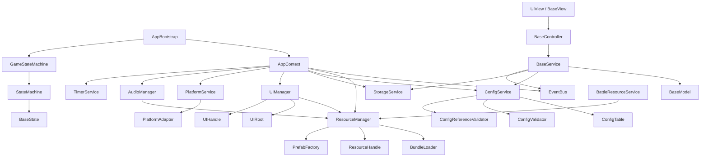

# Cocos Creator 3.8.8 手游框架类架构文档

适用项目：`framework`  
引擎版本：Cocos Creator `3.8.8`  
文档目标：细化当前项目从空工程到基础框架的开发任务，逐个说明基础类职责、边界、关键接口、fail-fast 要求和验收标准。

> 大厅 + 多子游戏模式说明：本文中 `HomeState`、`BattleState`、`SettlementState` 是早期单玩法基线命名。当前项目若采用大厅 + 多子游戏模式，以 `docs/FRAMEWORK_OVERVIEW.md` 和 `docs/systems/15_HALL_SUBGAME_SYSTEM.md` 为主，主流程应迁移为 `HallState -> SubGameLoadingState -> SubGameRunningState -> SubGameSettlementState -> HallState`。

---

## 1. 总体架构原则

### 1.1 核心目标

- 模块边界清晰，依赖方向稳定。
- UI 使用 MVC / MVP 分层，View 只负责显示和输入转发。
- 主流程使用 FSM 状态机，状态只负责编排流程。
- 跨模块通知使用 EventBus，但 EventBus 不承载完整业务流程。
- 玩法、道具、关卡、任务、商城、音频、引导等全部数据驱动。
- 平台 SDK 必须通过 PlatformAdapter 接入。
- 所有基础能力遵守 fail-fast：缺节点、缺资源、缺配置、非法状态、SDK 失败必须直接暴露。

### 1.2 Cocos Creator 3.8.8 约束

- 运行时代码放在 `assets/scripts`。
- 组件脚本继承 `Component`，使用 `_decorator` 的 `@ccclass`、`@property`。
- 节点依赖优先通过编辑器 `@property(Node)` 显式绑定。
- 禁止随意使用 `find` / `cc.find` 查询节点。
- Prefab、JsonAsset、SpriteFrame、AudioClip 等资源必须通过 `ResourceManager` 或专用服务加载。
- UI prefab 必须通过 `UIManager` 打开。
- 持久根节点由启动组件通过 `director.addPersistRootNode(this.node)` 管理。
- 本地存储由 `StorageService` 封装 `sys.localStorage`，业务模块不得直接访问。
- 当前 `tsconfig.json` 为 `strict: false`，建议框架稳定后逐步迁移到 `strict: true`。

### 1.3 推荐目录结构

```text
assets/
└─ scripts/
   ├─ main.ts
   ├─ core/
   │  ├─ app/
   │  ├─ error/
   │  ├─ logger/
   │  ├─ event/
   │  ├─ fsm/
   │  ├─ module/
   │  ├─ ui/
   │  ├─ resource/
   │  ├─ config/
   │  ├─ storage/
   │  ├─ audio/
   │  └─ timer/
   ├─ platform/
   ├─ configs/
   ├─ modules/
   └─ common/
```

### 1.4 依赖方向

```text
View
 ↓
Controller / Presenter
 ↓
Service
 ↓
Model / Repository Interface
 ↓
Adapter Implementation
```

规则：

- `core` 不依赖 `modules`。
- `modules` 可以依赖 `core` 的稳定接口。
- `Service` 可以改 `Model`，但不能直接操作 UI 节点。
- `View` 不直接读写存档、不直接请求 SDK、不直接加载业务资源。
- 模块之间不能直接修改彼此数据。

---

## 2. 启动与应用生命周期

### 2.1 `main.ts`

建议路径：`assets/scripts/main.ts`

功能：

- 项目脚本入口聚合文件。
- 导出启动组件与公共框架类型。
- 保持轻量，不写实际业务初始化。

禁止职责：

- 不写登录、背包、商城、关卡业务。
- 不直接加载资源。
- 不直接访问 SDK。

开发任务：

- 导出 `AppBootstrap`。
- 导出必要的 core 类型。

验收标准：

- 文件无复杂逻辑。
- 不依赖具体业务模块实现。

### 2.2 `AppBootstrap`

建议路径：`assets/scripts/core/app/AppBootstrap.ts`  
Cocos 类型：`Component`

功能：

- 挂载在启动场景根节点。
- 创建 `AppContext`。
- 初始化 Logger、EventBus、ResourceManager、UIManager、ConfigService、StorageService、PlatformService、AudioManager、TimerService。
- 注册主流程 FSM。
- 启动 `GameStateMachine`。
- 根据需要设置常驻节点。

关键接口：

```ts
@ccclass('AppBootstrap')
export class AppBootstrap extends Component {
  protected onLoad(): void
  protected start(): Promise<void>
  protected update(deltaTime: number): void
  protected onDestroy(): void
}
```

禁止职责：

- 不写具体登录逻辑。
- 不写配置表字段校验。
- 不直接打开业务 UI prefab。
- 不直接调用平台 SDK。

Fail-Fast：

- 重复启动直接抛错。
- 缺少基础服务直接抛错。
- 主 FSM 启动失败直接抛错。

开发任务：

- 创建启动场景根节点并挂载组件。
- 初始化框架服务并注册到 `AppContext`。
- 创建并启动主流程状态机。
- 销毁时释放上下文。

验收标准：

- 启动职责集中且可读。
- 没有业务逻辑散落在启动组件中。

### 2.3 `AppContext`

建议路径：`assets/scripts/core/app/AppContext.ts`

功能：

- 框架依赖上下文。
- 保存并查询基础服务实例。
- 替代滥用全局单例。
- 让模块通过显式 token 获取依赖。

关键接口：

```ts
export class AppContext {
  register<T>(token: ServiceToken<T>, instance: T): void
  get<T>(token: ServiceToken<T>): T
  has<T>(token: ServiceToken<T>): boolean
  dispose(): void
}
```

禁止职责：

- 不自动创建缺失服务。
- 不保存业务数据。
- 不做业务流程调度。

Fail-Fast：

- 重复注册 token 抛错。
- 查询未注册 token 抛错。
- dispose 后继续使用抛错。

开发任务：

- 实现 token 注册表。
- 实现 dispose 生命周期。
- 错误信息包含 token 名。

验收标准：

- 依赖来源清晰。
- 没有默认实例或 mock 兜底。

### 2.4 `ServiceToken`

建议路径：`assets/scripts/core/app/ServiceToken.ts`

功能：

- 作为 `AppContext` 的类型安全 key。
- 避免裸字符串冲突。

关键接口：

```ts
export interface ServiceToken<T> {
  readonly name: string
}

export function createServiceToken<T>(name: string): ServiceToken<T>
```

开发任务：

- 实现 token 创建函数。
- 为核心服务定义 `CoreTokens`。

验收标准：

- 所有核心服务通过 token 注册和读取。

### 2.5 `Disposable`

建议路径：`assets/scripts/core/app/Disposable.ts`

功能：

- 统一释放协议。
- 用于事件订阅、计时器、资源句柄、UI 句柄。

关键接口：

```ts
export interface Disposable {
  dispose(): void
}
```

验收标准：

- 生命周期结束时能统一清理。

---

## 3. 错误与日志基础类

### 3.1 `FrameworkError`

建议路径：`assets/scripts/core/error/FrameworkError.ts`

功能：

- 框架统一错误类型。
- 错误信息包含模块名、错误码、失败原因、关键参数、当前状态。

关键接口：

```ts
export class FrameworkError extends Error {
  readonly module: string
  readonly code: string
  readonly details?: Record<string, unknown>
}
```

禁止职责：

- 不吞异常。
- 不把错误转换成默认值。

开发任务：

- 支持 cause。
- 格式化错误消息。

验收标准：

- 基础服务抛错时能定位模块和参数。

### 3.2 `Assert`

建议路径：`assets/scripts/core/error/Assert.ts`

功能：

- 提供 fail-fast 断言。
- 用于节点、配置、资源、状态、参数校验。

关键接口：

```ts
export class Assert {
  static notNull<T>(value: T | null | undefined, message: string, details?: object): T
  static isTrue(condition: boolean, message: string, details?: object): void
  static nonEmptyString(value: string, message: string, details?: object): string
  static validState(condition: boolean, stateName: string, message: string): void
}
```

禁止职责：

- 不提供 `tryOrDefault`。
- 不提供任何 fallback 辅助函数。

验收标准：

- 缺节点、缺配置、非法状态立即抛错。

### 3.3 `ErrorReporter`

建议路径：`assets/scripts/core/error/ErrorReporter.ts`

功能：

- 统一接收错误。
- 开发期输出完整上下文。
- 生产期可接平台错误上报。

关键接口：

```ts
export interface ErrorReporter {
  report(error: unknown, context?: Record<string, unknown>): void
}
```

禁止职责：

- 不决定业务恢复策略。
- 不吞异常。

### 3.4 `Logger`

建议路径：`assets/scripts/core/logger/Logger.ts`

功能：

- 统一日志接口。
- 日志必须带模块名。

关键接口：

```ts
export interface Logger {
  debug(module: string, message: string, details?: object): void
  info(module: string, message: string, details?: object): void
  warn(module: string, message: string, details?: object): void
  error(module: string, message: string, details?: object): void
}
```

禁止职责：

- 不用日志替代抛错。
- 不在 fatal 问题上 warn 后继续执行。

### 3.5 `ConsoleLogger` 与 `LogLevel`

建议路径：

- `assets/scripts/core/logger/ConsoleLogger.ts`
- `assets/scripts/core/logger/LogLevel.ts`

功能：

- `ConsoleLogger`：基于 Cocos / 浏览器 console 输出日志。
- `LogLevel`：控制 Debug、Info、Warn、Error、None。

关键枚举：

```ts
export enum LogLevel {
  Debug = 10,
  Info = 20,
  Warn = 30,
  Error = 40,
  None = 99,
}
```

验收标准：

- 日志等级不改变业务执行结果。

---

## 4. 事件系统基础类

### 4.1 `EventBus`

建议路径：`assets/scripts/core/event/EventBus.ts`

功能：

- 跨模块通知。
- 支持 `on`、`once`、`off`、`emit`。
- 返回订阅句柄，便于释放。
- 使用事件类型映射约束 payload。

关键接口：

```ts
export class EventBus<TEventMap extends Record<string, unknown>> {
  on<K extends keyof TEventMap>(eventName: K, handler: EventHandler<TEventMap[K]>): EventSubscription
  once<K extends keyof TEventMap>(eventName: K, handler: EventHandler<TEventMap[K]>): EventSubscription
  off<K extends keyof TEventMap>(eventName: K, handler: EventHandler<TEventMap[K]>): void
  emit<K extends keyof TEventMap>(eventName: K, payload: TEventMap[K]): void
  clear(): void
}
```

禁止职责：

- 不承载完整业务流程。
- 不隐式修改其他模块数据。
- 不吞监听器异常。

Fail-Fast：

- 未定义事件抛错。
- handler 执行失败暴露错误。

开发任务：

- 定义 `EventHandler`。
- 实现监听器列表。
- 派发时复制监听器快照。
- 返回 `EventSubscription`。

验收标准：

- EventBus 只做通知。
- 监听释放可靠。

### 4.2 `EventSubscription`

建议路径：`assets/scripts/core/event/EventSubscription.ts`

功能：

- 表示一次事件订阅。
- 提供 `dispose()` 解除监听。

关键接口：

```ts
export interface EventSubscription extends Disposable {
  readonly eventName: string
  readonly disposed: boolean
}
```

验收标准：

- View / Controller / Module 销毁时能统一释放事件。

### 4.3 `AppEventMap`

建议路径：`assets/scripts/core/event/AppEventMap.ts`

功能：

- 定义系统级事件类型。
- 不包含具体背包、商城、关卡业务。

示例：

```ts
export interface AppEventMap {
  ConfigLoaded: { tableNames: string[] }
  ResourceLoaded: { path: string; type: string }
  StateChanged: { from: string | null; to: string }
}
```

验收标准：

- core 事件保持通用，业务事件放在各模块 `*Events.ts`。

---

## 5. FSM 状态机基础类

### 5.1 `IState`

建议路径：`assets/scripts/core/fsm/IState.ts`

功能：

- 定义状态接口。
- 每个状态实现 enter、exit、update。

关键接口：

```ts
export interface IState<TStateId extends string> {
  readonly id: TStateId
  enter(params?: unknown): Promise<void> | void
  exit(): Promise<void> | void
  update?(deltaTime: number): void
}
```

禁止职责：

- 状态不写复杂业务规则。
- 状态之间不直接调用内部方法。

### 5.2 `BaseState`

建议路径：`assets/scripts/core/fsm/BaseState.ts`

功能：

- 状态基类。
- 持有必要框架依赖。
- 统一状态生命周期日志。

关键接口：

```ts
export abstract class BaseState<TStateId extends string> implements IState<TStateId> {
  abstract readonly id: TStateId
  enter(params?: unknown): Promise<void> | void
  exit(): Promise<void> | void
  update?(deltaTime: number): void
}
```

禁止职责：

- 不保存跨状态业务数据。
- 不替 Service 做业务决策。

### 5.3 `StateMachine`

建议路径：`assets/scripts/core/fsm/StateMachine.ts`

功能：

- 注册状态。
- 控制状态切换。
- 保证 exit / enter 顺序。
- 提供当前状态查询。

关键接口：

```ts
export class StateMachine<TStateId extends string> {
  register(state: IState<TStateId>): void
  start(initialState: TStateId, params?: unknown): Promise<void>
  changeTo(nextState: TStateId, params?: unknown): Promise<void>
  update(deltaTime: number): void
  getCurrentStateId(): TStateId | null
}
```

Fail-Fast：

- 未注册状态抛错。
- 重复注册状态抛错。
- 非法转移抛错。
- enter / exit 失败抛错。
- 切换中重复切换必须明确报错或使用显式队列策略。

开发任务：

- 实现状态表。
- 实现切换锁。
- 集成转移表。
- 派发 `StateChanged` 事件。

### 5.4 `StateTransitionTable`

建议路径：`assets/scripts/core/fsm/StateTransitionTable.ts`

功能：

- 定义合法状态转移。
- 防止任意跳状态。

关键接口：

```ts
export class StateTransitionTable<TStateId extends string> {
  allow(from: TStateId, to: TStateId): void
  canTransit(from: TStateId | null, to: TStateId): boolean
  assertCanTransit(from: TStateId | null, to: TStateId): void
}
```

验收标准：

- `Battle` 不能绕过规则随意回任意状态。

### 5.5 `GameStateMachine` 与 `GameState`

建议路径：

- `assets/scripts/core/app/GameStateMachine.ts`
- `assets/scripts/core/app/GameState.ts`

功能：

- 主流程状态机的项目级封装。
- 注册 Boot、LoadConfig、Login、Home、Battle、Settlement。

建议枚举：

```ts
export enum GameState {
  Boot = 'Boot',
  LoadConfig = 'LoadConfig',
  Login = 'Login',
  Home = 'Home',
  Battle = 'Battle',
  Settlement = 'Settlement',
}
```

验收标准：

- 主流程按合法顺序启动并进入 Home。

---

## 6. 模块基础类

### 6.1 `IModule`

建议路径：`assets/scripts/core/module/IModule.ts`

功能：

- 定义业务模块生命周期。
- 支持初始化、启动、释放。

关键接口：

```ts
export interface IModule {
  readonly name: string
  init(context: AppContext): Promise<void> | void
  start?(): Promise<void> | void
  dispose(): void
}
```

禁止职责：

- 模块 init 不直接打开 UI。
- 模块不直接读取其他模块内部 Model。

验收标准：

- 模块可以独立初始化和释放。

### 6.2 `BaseModule`

建议路径：`assets/scripts/core/module/BaseModule.ts`

功能：

- 模块生命周期基类。
- 持有 `AppContext`。
- 统一管理事件订阅、计时器、资源句柄。

关键接口：

```ts
export abstract class BaseModule implements IModule {
  abstract readonly name: string
  init(context: AppContext): Promise<void> | void
  start?(): Promise<void> | void
  dispose(): void
}
```

禁止职责：

- 不做万能模块基类。
- 不包含背包、商城、关卡等具体业务公共逻辑。

开发任务：

- 添加 `protected disposables: Disposable[]`。
- 提供 `track(disposable)`。
- dispose 时按注册顺序释放。

验收标准：

- 模块销毁后没有事件和 timer 泄漏。

### 6.3 `ModuleRegistry`

建议路径：`assets/scripts/core/module/ModuleRegistry.ts`

功能：

- 注册业务模块。
- 控制模块初始化顺序。
- 查询模块公开接口。

关键接口：

```ts
export class ModuleRegistry {
  register(module: IModule): void
  initAll(context: AppContext): Promise<void>
  startAll(): Promise<void>
  get<T extends IModule>(name: string): T
  dispose(): void
}
```

禁止职责：

- 不做超级 Manager。
- 不承载业务数据交换。
- 不隐式创建缺失模块。

Fail-Fast：

- 重复模块名抛错。
- 查询不存在模块抛错。
- 初始化失败直接中断。

### 6.4 `BaseModel`

建议路径：`assets/scripts/core/module/BaseModel.ts`

功能：

- 业务模块状态基类。
- 保存和查询模块数据。
- 提供变更版本号，便于 UI 判断是否需要刷新。

关键接口：

```ts
export abstract class BaseModel {
  protected version = 0
  getVersion(): number
  protected markChanged(): void
}
```

禁止职责：

- 不操作 UI。
- 不调用 SDK。
- 不直接读写本地存储。

验收标准：

- Model 可以脱离 Cocos 单测。

### 6.5 `BaseService`

建议路径：`assets/scripts/core/module/BaseService.ts`

功能：

- 业务逻辑基类。
- 负责业务规则、状态修改、事件派发。
- 通过显式依赖访问 Model、Config、Storage、Platform 等能力。

关键接口：

```ts
export abstract class BaseService {
  dispose?(): void
}
```

禁止职责：

- 不直接操作 UI 节点。
- 不直接依赖具体 SDK 实现。
- 不吞业务错误。

验收标准：

- Service 是核心业务单测对象。

### 6.6 `BaseController`

建议路径：`assets/scripts/core/module/BaseController.ts`

功能：

- UI 交互调度基类。
- 接收 View 的输入。
- 调用 Service。
- 控制 View 刷新。

关键接口：

```ts
export abstract class BaseController<TView> {
  bindView(view: TView): void
  unbindView(): void
  dispose(): void
}
```

禁止职责：

- 不保存核心业务状态。
- 不直接写存档。
- 不直接请求 SDK。

验收标准：

- 用户点击入口都经过 Controller。

### 6.7 `ModuleFacade`

建议路径：`assets/scripts/core/module/ModuleFacade.ts`

功能：

- 定义模块对外 API。
- 其他模块只依赖 facade，不访问内部 Model。

关键接口：

```ts
export interface ModuleFacade {
  readonly moduleName: string
}
```

禁止职责：

- 不暴露内部可变数据引用。
- 不提供绕过 Service 的修改入口。

---

## 7. UI 框架基础类

### 7.1 `BaseView`

建议路径：`assets/scripts/core/ui/BaseView.ts`  
Cocos 类型：`Component`

功能：

- UI 显示基类。
- 负责节点绑定、事件绑定、渲染刷新、动画播放。
- 在 `onLoad` 中完成绑定。
- 在 `onDestroy` 中释放订阅。

关键接口：

```ts
export abstract class BaseView extends Component {
  protected abstract bindNodes(): void
  protected abstract bindEvents(): void
  protected abstract render(): void
  show(): void
  hide(): void
}
```

禁止职责：

- 不写业务规则。
- 不读写存档。
- 不请求平台 SDK。
- 不直接加载业务资源。

Fail-Fast：

- 必要节点未绑定抛错。
- Controller 未绑定但发生交互抛错。

### 7.2 `UIView`

建议路径：`assets/scripts/core/ui/UIView.ts`

功能：

- 标准面板 View 基类。
- 在 `BaseView` 上增加打开参数、关闭生命周期和 UI id。

关键接口：

```ts
export abstract class UIView<TOpenParams = void> extends BaseView {
  open(params: TOpenParams): void
  close(): void
}
```

禁止职责：

- 不决定 prefab 路径。
- 不自行销毁节点，交给 `UIManager`。

### 7.3 `BasePresenter`

建议路径：`assets/scripts/core/ui/BasePresenter.ts`

功能：

- MVP 场景下连接 View 和 Service。
- 负责展示数据组装。

关键接口：

```ts
export abstract class BasePresenter<TView> {
  attach(view: TView): void
  detach(): void
  refresh(): void
}
```

禁止职责：

- 不修改 Model。
- 不直接打开其他 UI。

适用场景：

- 页面展示数据复杂。
- 一个 View 组合多个 Service 查询结果。

### 7.4 `UIManager`

建议路径：`assets/scripts/core/ui/UIManager.ts`

功能：

- 统一打开和关闭 UI。
- 负责 UI prefab 加载。
- 负责 UI 层级挂载。
- 负责 UI 缓存策略。
- 负责 UI 句柄管理。

关键接口：

```ts
export class UIManager {
  open<TParams, TResult = void>(uiId: string, params: TParams): Promise<UIHandle<TResult>>
  close(uiId: string): void
  closeAll(layer?: UILayer): void
  isOpen(uiId: string): boolean
}
```

禁止职责：

- 不处理背包、商城、任务、关卡业务。
- 不根据业务状态自动打开 UI。
- 不 fallback 到默认 prefab。

Fail-Fast：

- 未注册 UI id 抛错。
- prefab 加载失败抛错。
- prefab 根节点缺少 View 组件抛错。
- UI 层级根节点缺失抛错。

开发任务：

- 定义并校验 `UIConfig`。
- 通过 `ResourceManager` 加载 prefab。
- 使用 `PrefabFactory` 实例化。
- 挂载到 `UIRoot` 对应层级。
- 创建并返回 `UIHandle`。

### 7.5 `UIConfig`

建议路径：`assets/scripts/core/ui/UIConfig.ts`

功能：

- 描述 UI id、prefab 路径、层级、缓存策略、是否单例。

关键接口：

```ts
export interface UIConfig {
  readonly id: string
  readonly prefabPath: string
  readonly layer: UILayer
  readonly cache: boolean
  readonly singleton: boolean
}
```

验收标准：

- UI 路径集中管理，不散落在业务代码中。

### 7.6 `UILayer`

建议路径：`assets/scripts/core/ui/UILayer.ts`

功能：

- 定义 UI 层级。

关键枚举：

```ts
export enum UILayer {
  Background = 'Background',
  Normal = 'Normal',
  Popup = 'Popup',
  Guide = 'Guide',
  Toast = 'Toast',
  Loading = 'Loading',
}
```

验收标准：

- 层级稳定，不靠业务动态猜测。

### 7.7 `UIRoot`

建议路径：`assets/scripts/core/ui/UIRoot.ts`  
Cocos 类型：`Component`

功能：

- 挂在 UI 根节点。
- 通过 `@property(Node)` 显式绑定各 UI 层级节点。
- 提供 `getLayerRoot(layer)`。

关键接口：

```ts
@ccclass('UIRoot')
export class UIRoot extends Component {
  getLayerRoot(layer: UILayer): Node
}
```

禁止职责：

- 不使用 `find` 动态找层级。
- 不负责打开 UI。

Fail-Fast：

- 任一层级未绑定直接抛错。

### 7.8 `UIHandle`

建议路径：`assets/scripts/core/ui/UIHandle.ts`

功能：

- 表示一次 UI 打开实例。
- 提供关闭和等待关闭结果能力。

关键接口：

```ts
export class UIHandle<TResult = void> implements Disposable {
  readonly uiId: string
  readonly node: Node
  close(result?: TResult): void
  waitForClose(): Promise<TResult>
  dispose(): void
}
```

禁止职责：

- 不暴露内部 Controller。
- 不允许外部随意修改 View 内部状态。

### 7.9 `NodeBinder`

建议路径：`assets/scripts/core/ui/NodeBinder.ts`

功能：

- 为 View 提供节点和组件校验辅助。
- 校验 `@property` 显式绑定是否完整。

关键接口：

```ts
export class NodeBinder {
  static requireNode(node: Node | null | undefined, owner: string, fieldName: string): Node
  static requireComponent<T extends Component>(node: Node, type: Constructor<T>, owner: string): T
}
```

禁止职责：

- 不提供全局 `find`。
- 不吞缺节点错误。

### 7.10 `ToastService`

建议路径：`assets/scripts/core/ui/ToastService.ts`

功能：

- 统一显示轻提示。
- 本质是 UI 能力，不承担业务判断。

关键接口：

```ts
export class ToastService {
  show(message: string): Promise<void>
}
```

禁止职责：

- 不把业务错误自动转成 toast 后吞掉。

### 7.11 `LoadingService`

建议路径：`assets/scripts/core/ui/LoadingService.ts`

功能：

- 统一显示加载遮罩。
- 使用 token 或引用计数管理多个异步任务。

关键接口：

```ts
export class LoadingService {
  show(reason: string): LoadingToken
  hide(token: LoadingToken): void
}
```

禁止职责：

- 不吞异步任务错误。
- 不改变任务结果。

---

## 8. 资源系统基础类

### 8.1 `ResourceManager`

建议路径：`assets/scripts/core/resource/ResourceManager.ts`

功能：

- 统一加载资源。
- 统一释放资源。
- 管理 bundle。
- 管理缓存和引用计数。
- 支持预加载。

Cocos 类型：`Asset`、`Prefab`、`JsonAsset`、`SpriteFrame`、`AudioClip`、`assetManager`、`resources`

关键接口：

```ts
export class ResourceManager {
  load<T extends Asset>(path: string, type: AssetType<T>, options?: LoadOptions): Promise<T>
  loadFromBundle<T extends Asset>(bundleName: string, path: string, type: AssetType<T>): Promise<T>
  preload(path: string, type: AssetType<Asset>): Promise<void>
  retain(asset: Asset, reason: string): void
  release(asset: Asset, reason: string): void
  releaseByOwner(ownerId: string): void
}
```

禁止职责：

- 不处理 UI 业务。
- 不返回默认资源。
- 不 mock 资源兜底。

Fail-Fast：

- path 为空抛错。
- 资源加载失败抛错。
- 类型不匹配抛错。
- 释放未知资源必须暴露。

### 8.2 `ResourceHandle`

建议路径：`assets/scripts/core/resource/ResourceHandle.ts`

功能：

- 表示一次资源持有。
- 绑定 owner，便于批量释放。

关键接口：

```ts
export class ResourceHandle<T extends Asset> implements Disposable {
  readonly asset: T
  readonly path: string
  readonly ownerId: string
  dispose(): void
}
```

验收标准：

- 关卡退出时可以按 owner 释放玩法资源。

### 8.3 `ResourceKey`

建议路径：`assets/scripts/core/resource/ResourceKey.ts`

功能：

- 唯一描述一个资源。
- 区分 bundle、path、type。

关键接口：

```ts
export interface ResourceKey {
  readonly bundle?: string
  readonly path: string
  readonly typeName: string
}
```

验收标准：

- 同名不同 bundle 的资源不会冲突。

### 8.4 `BundleLoader`

建议路径：`assets/scripts/core/resource/BundleLoader.ts`

功能：

- 专门加载和缓存 Asset Bundle。
- 由 `ResourceManager` 组合使用。

关键接口：

```ts
export class BundleLoader {
  loadBundle(bundleName: string): Promise<AssetManager.Bundle>
  getBundle(bundleName: string): AssetManager.Bundle
  releaseBundle(bundleName: string): void
}
```

禁止职责：

- 不加载具体业务资源。

### 8.5 `PrefabFactory`

建议路径：`assets/scripts/core/resource/PrefabFactory.ts`

功能：

- 统一实例化 prefab。
- 校验 prefab 类型。

关键接口：

```ts
export class PrefabFactory {
  instantiate(prefab: Prefab, owner: string): Node
}
```

禁止职责：

- 不加载 prefab。
- 不决定挂载父节点。

### 8.6 `BattleResourceService`

建议路径：`assets/scripts/core/resource/BattleResourceService.ts`

功能：

- 管理玩法 / 关卡资源生命周期。
- 进入关卡预加载资源。
- 退出关卡释放资源。

关键接口：

```ts
export class BattleResourceService {
  preloadForLevel(levelId: number): Promise<void>
  releaseLevel(levelId: number): void
}
```

禁止职责：

- 不判定胜负。
- 不发奖励。
- 不打开战斗 UI。

验收标准：

- BattleState 退出时释放关卡资源。

---

## 9. 配置系统基础类

### 9.1 `ConfigService`

建议路径：`assets/scripts/core/config/ConfigService.ts`

功能：

- 统一加载配置。
- 统一解析配置。
- 统一校验配置。
- 注册只读配置表。
- 对业务提供只读查询。

关键接口：

```ts
export class ConfigService {
  loadAll(manifest: ConfigManifest): Promise<void>
  getTable<T>(tableName: string): ConfigTable<T>
  getById<T extends { id: string | number }>(tableName: string, id: T['id']): T
  hasLoaded(): boolean
}
```

禁止职责：

- 不补默认值。
- 不在缺配置时返回空表。
- 不允许 mock 配置兜底。

Fail-Fast：

- 配置文件缺失抛错。
- JSON 格式错误抛错。
- 字段缺失抛错。
- ID 重复抛错。
- 引用不存在抛错。

### 9.2 `ConfigManifest`

建议路径：`assets/scripts/core/config/ConfigManifest.ts`

功能：

- 描述项目有哪些配置表。
- 包含表名、资源路径、validator。

关键接口：

```ts
export interface ConfigManifestItem<T> {
  readonly tableName: string
  readonly path: string
  readonly validator: ConfigValidator<T>
}

export interface ConfigManifest {
  readonly tables: ConfigManifestItem<unknown>[]
}
```

验收标准：

- 新配置表必须显式登记。

### 9.3 `ConfigValidator`

建议路径：`assets/scripts/core/config/ConfigValidator.ts`

功能：

- 单表结构校验。
- 字段类型校验。
- ID 唯一校验。

关键接口：

```ts
export interface ConfigValidator<T> {
  validateRows(rows: unknown[]): T[]
}
```

禁止职责：

- 不补字段。
- 不删除非法行后继续。

验收标准：

- 错误能定位到表名、行号、字段名、错误值。

### 9.4 `ConfigTable`

建议路径：`assets/scripts/core/config/ConfigTable.ts`

功能：

- 只读配置表。
- 按 id 查询。
- 遍历所有行。

关键接口：

```ts
export class ConfigTable<T extends { id: string | number }> {
  get(id: T['id']): T
  has(id: T['id']): boolean
  getAll(): readonly T[]
}
```

禁止职责：

- 不允许运行时修改配置。
- `get` 缺失时不返回 undefined，直接抛错。

### 9.5 `ConfigReferenceValidator`

建议路径：`assets/scripts/core/config/ConfigReferenceValidator.ts`

功能：

- 跨配置表引用校验。
- 例如关卡奖励引用 reward_config，reward 引用 item_config，audio key 引用资源。

关键接口：

```ts
export interface ConfigReferenceValidator {
  validate(configService: ConfigService): void
}
```

禁止职责：

- 不在引用缺失时忽略该配置。

### 9.6 `BaseConfigRepository`

建议路径：`assets/scripts/core/config/BaseConfigRepository.ts`

功能：

- 给业务模块封装配置读取。
- 将原始表查询转成业务友好的方法。

关键接口：

```ts
export abstract class BaseConfigRepository<T extends { id: string | number }> {
  getById(id: T['id']): T
  getAll(): readonly T[]
}
```

禁止职责：

- 不缓存可变业务状态。
- 不补默认配置。

---

## 10. 存储系统基础类

### 10.1 `StorageService`

建议路径：`assets/scripts/core/storage/StorageService.ts`

功能：

- 统一读写本地存档。
- 校验存档结构。
- 处理版本迁移。
- 暴露明确的新用户创建流程。

Cocos 类型：`sys.localStorage`

关键接口：

```ts
export class StorageService {
  load(): SaveData
  save(data: SaveData): void
  exists(): boolean
  createNew(initialData: SaveData): void
  clearForDebug(reason: string): void
}
```

禁止职责：

- 不在读取失败后返回空对象。
- 不静默重置用户存档。
- 不自动修复未知数据。

Fail-Fast：

- 存档 JSON 解析失败抛错。
- 存档结构非法抛错。
- 版本不匹配但无迁移器抛错。

### 10.2 `SaveData`

建议路径：`assets/scripts/core/storage/SaveData.ts`

功能：

- 定义存档根结构。

建议结构：

```ts
export interface SaveData {
  version: number
  player: PlayerSaveData
  bag: BagSaveData
  level: LevelSaveData
  shop: ShopSaveData
  task: TaskSaveData
}
```

验收标准：

- 存档结构稳定，不使用任意对象。

### 10.3 `SaveDataValidator`

建议路径：`assets/scripts/core/storage/SaveDataValidator.ts`

功能：

- 校验存档字段完整性和类型。
- 校验版本号。
- 校验模块存档结构。

关键接口：

```ts
export interface SaveDataValidator {
  validate(data: unknown): SaveData
}
```

禁止职责：

- 不补字段。
- 不删除非法字段后继续。

### 10.4 `SaveMigration`

建议路径：`assets/scripts/core/storage/SaveMigration.ts`

功能：

- 定义一个存档版本迁移单元。

关键接口：

```ts
export interface SaveMigration {
  readonly fromVersion: number
  readonly toVersion: number
  migrate(data: unknown): unknown
}
```

禁止职责：

- 不吞迁移错误。
- 不跳版本自动猜测。

### 10.5 `SaveMigrationPipeline`

建议路径：`assets/scripts/core/storage/SaveMigrationPipeline.ts`

功能：

- 串联多个 SaveMigration。
- 从旧版本迁移到当前版本。

关键接口：

```ts
export class SaveMigrationPipeline {
  migrateToCurrent(data: unknown, currentVersion: number): unknown
}
```

Fail-Fast：

- 缺迁移路径抛错。
- 迁移后版本不匹配抛错。

### 10.6 `SaveRepository`

建议路径：`assets/scripts/core/storage/SaveRepository.ts`

功能：

- 面向模块封装存档片段读写。
- 避免模块直接操作整个 SaveData。

关键接口：

```ts
export interface SaveRepository<TModuleSave> {
  load(): TModuleSave
  save(data: TModuleSave): void
}
```

禁止职责：

- 不允许模块越权修改其他模块存档。

---

## 11. 平台适配基础类

### 11.1 `PlatformAdapter`

建议路径：`assets/scripts/platform/PlatformAdapter.ts`

功能：

- 定义平台能力接口。
- 业务只依赖接口，不依赖微信、安卓、iOS、Web SDK 实现。

关键接口：

```ts
export interface PlatformAdapter {
  login(): Promise<LoginResult>
  pay(order: PayOrder): Promise<PayResult>
  share(params: ShareParams): Promise<ShareResult>
  showRewardAd(adId: string): Promise<RewardAdResult>
  vibrate(type: VibrateType): void
}
```

禁止职责：

- 不写业务奖励逻辑。
- 不在 SDK 失败后返回成功。

### 11.2 `PlatformService`

建议路径：`assets/scripts/platform/PlatformService.ts`

功能：

- 持有当前平台 adapter。
- 给业务提供统一平台能力入口。
- 包装 SDK 错误上下文。

关键接口：

```ts
export class PlatformService {
  setAdapter(adapter: PlatformAdapter): void
  login(): Promise<LoginResult>
  pay(order: PayOrder): Promise<PayResult>
  share(params: ShareParams): Promise<ShareResult>
  showRewardAd(adId: string): Promise<RewardAdResult>
}
```

禁止职责：

- 不根据失败结果发奖励。
- 不静默降级到 WebAdapter。

Fail-Fast：

- 未设置 adapter 抛错。
- SDK 调用失败带平台名、接口名、参数。

### 11.3 `WebPlatformAdapter`

建议路径：`assets/scripts/platform/WebPlatformAdapter.ts`

功能：

- Web 运行环境平台实现。
- 只实现 Web 真正支持的能力。

禁止职责：

- 不作为所有平台失败后的 fallback。
- 不模拟支付成功、广告成功。

验收标准：

- 不支持的能力明确抛错。

### 11.4 `WechatPlatformAdapter`

建议路径：`assets/scripts/platform/WechatPlatformAdapter.ts`

功能：

- 微信小游戏平台实现。
- 封装微信登录、分享、广告、震动等 SDK。

禁止职责：

- 不直接修改业务数据。
- 不在广告未完成时返回成功。

验收标准：

- 微信 SDK 调用失败能向业务暴露。

### 11.5 `PlatformTypes`

建议路径：`assets/scripts/platform/PlatformTypes.ts`

功能：

- 定义 `LoginResult`、`PayOrder`、`PayResult`、`ShareParams`、`RewardAdResult`、`VibrateType` 等平台数据结构。

禁止职责：

- 不包含平台实现逻辑。

验收标准：

- 替换 adapter 不影响业务服务。

---

## 12. 音频系统基础类

### 12.1 `AudioManager`

建议路径：`assets/scripts/core/audio/AudioManager.ts`

功能：

- 统一播放 BGM 和 SFX。
- 根据 audio_config 查找音频资源。
- 通过 ResourceManager 加载 AudioClip。
- 管理音量和静音。

Cocos 类型：`AudioSource`、`AudioClip`

关键接口：

```ts
export class AudioManager {
  playBgm(audioKey: string): Promise<void>
  stopBgm(): void
  playSfx(audioKey: string): Promise<void>
  setBgmVolume(volume: number): void
  setSfxVolume(volume: number): void
  mute(muted: boolean): void
}
```

禁止职责：

- 不把缺音频当成成功。
- 不直接使用硬编码资源路径播放。

Fail-Fast：

- audioKey 不存在抛错。
- 资源加载失败抛错。
- AudioSource 未绑定抛错。

### 12.2 `AudioConfigRepository`

建议路径：`assets/scripts/core/audio/AudioConfigRepository.ts`

功能：

- 读取音频配置。
- 根据 key 返回资源路径、音量、循环设置。

关键接口：

```ts
export class AudioConfigRepository extends BaseConfigRepository<AudioConfig> {
  getAudio(key: string): AudioConfig
}
```

禁止职责：

- 不补默认音量。
- 不返回默认音频。

### 12.3 `AudioRoot`

建议路径：`assets/scripts/core/audio/AudioRoot.ts`  
Cocos 类型：`Component`

功能：

- 挂在常驻音频节点。
- 通过 `@property(AudioSource)` 绑定 BGM 与 SFX 音源。

禁止职责：

- 不决定播放哪个音频。
- 不读取配置。

---

## 13. 定时器系统基础类

### 13.1 `TimerService`

建议路径：`assets/scripts/core/timer/TimerService.ts`

功能：

- 统一管理延迟、循环、倒计时任务。
- 返回可释放句柄。
- 支持按 owner 清理。

关键接口：

```ts
export class TimerService {
  delay(seconds: number, callback: () => void, owner: string): TimerHandle
  interval(seconds: number, callback: () => void, owner: string): TimerHandle
  clearByOwner(owner: string): void
  update(deltaTime: number): void
}
```

禁止职责：

- 不写业务倒计时规则。
- 不吞 callback 异常。

验收标准：

- 模块退出后没有遗留 timer。

### 13.2 `TimerHandle`

建议路径：`assets/scripts/core/timer/TimerHandle.ts`

功能：

- 表示一个计时器任务。
- 提供 cancel / dispose。

关键接口：

```ts
export interface TimerHandle extends Disposable {
  readonly id: number
  readonly owner: string
  cancel(): void
}
```

验收标准：

- UI 关闭后 timer 回调不会打到已销毁 View。

---

## 14. 主流程状态类

### 14.1 `BootState`

建议路径：`assets/scripts/core/app/states/BootState.ts`

功能：

- 初始化基础框架。
- 校验 `AppContext` 基础服务完整。
- 进入 `LoadConfigState`。

禁止职责：

- 不加载业务配置内容。
- 不做登录。

验收标准：

- 框架依赖缺失时启动失败且错误清晰。

### 14.2 `LoadConfigState`

建议路径：`assets/scripts/core/app/states/LoadConfigState.ts`

功能：

- 调用 `ConfigService` 加载和校验全部配置。
- 成功后进入 `LoginState`。

禁止职责：

- 不补默认配置。
- 不在配置失败后继续进入游戏。

验收标准：

- 任意配置错误阻止继续启动。

### 14.3 `LoginState`

建议路径：`assets/scripts/core/app/states/LoginState.ts`

功能：

- 调用 `PlatformService` 登录。
- 读取或创建存档。
- 初始化玩家相关模块。
- 成功后进入 `HomeState`。

禁止职责：

- 不操作登录 UI 节点。
- 不直接调用第三方 SDK。
- 不静默创建空存档。

验收标准：

- SDK 失败、存档损坏都会阻止进入 Home。

### 14.4 `HomeState`

建议路径：`assets/scripts/core/app/states/HomeState.ts`

功能：

- 打开主界面。
- 处理从登录、结算返回主界面的流程。

禁止职责：

- 不写主界面业务逻辑。
- 不直接发奖励。

验收标准：

- Home UI 通过 `UIManager` 打开。

### 14.5 `BattleState`

建议路径：`assets/scripts/core/app/states/BattleState.ts`

功能：

- 进入关卡流程。
- 调用 `BattleResourceService` 预加载玩法资源。
- 打开战斗 UI。
- 战斗结束后进入 `SettlementState`。

禁止职责：

- 不判定具体玩法胜负细节。
- 不直接修改奖励数据。

验收标准：

- 关卡退出时玩法资源释放。

### 14.6 `SettlementState`

建议路径：`assets/scripts/core/app/states/SettlementState.ts`

功能：

- 处理战斗结算流程。
- 调用奖励、任务、关卡 Service。
- 打开结算 UI。
- 结算关闭后回到 Home。

禁止职责：

- 不直接写背包 Model。
- 不把广告失败当成功奖励。

验收标准：

- 奖励发放由 Service 完成，状态只编排流程。

---

## 15. 业务模块模板

### 15.1 推荐结构

```text
modules/example/
├─ ExampleModule.ts
├─ ExampleModel.ts
├─ ExampleService.ts
├─ ExampleController.ts
├─ ExampleView.ts
├─ ExampleTypes.ts
├─ ExampleEvents.ts
├─ ExampleConfigRepository.ts
└─ index.ts
```

### 15.2 `ExampleModule`

功能：

- 组合模块内部 Model、Service、Controller、ConfigRepository。
- 向 `ModuleRegistry` 注册。
- 暴露必要 Facade。

禁止职责：

- 不写具体业务规则。
- 不打开 UI。

### 15.3 `ExampleModel`

功能：

- 保存模块内部状态。
- 提供只读查询。
- 状态修改由 Service 触发。

禁止职责：

- 不操作 UI。
- 不读写存档。

### 15.4 `ExampleService`

功能：

- 执行业务规则。
- 修改 Model。
- 读取配置。
- 通过 EventBus 发出变化通知。

禁止职责：

- 不直接修改其他模块 Model。
- 不直接操作 View。

### 15.5 `ExampleController`

功能：

- 接收 View 输入。
- 调用 Service。
- 将结果交给 View 渲染。

禁止职责：

- 不写核心业务规则。
- 不直接访问 StorageService 执行存档细节。

### 15.6 `ExampleView`

功能：

- 绑定节点。
- 展示数据。
- 播放动画。
- 把用户操作交给 Controller。

禁止职责：

- 不读写业务状态。
- 不直接访问 SDK、存档、资源加载。

---

## 16. 常用业务系统类

### 16.1 `AdService`

建议路径：`assets/scripts/modules/ad/AdService.ts`

功能：

- 封装广告业务入口。
- 调用 PlatformService 展示广告。
- 返回广告观看结果。

禁止职责：

- 不发奖励。
- 不在广告失败后默认成功。

### 16.2 `RewardService`

建议路径：`assets/scripts/modules/reward/RewardService.ts`

功能：

- 根据 reward_config 计算奖励。
- 调用背包、货币等模块公开 API 发放奖励。

禁止职责：

- 不打开结算 UI。
- 不绕过其他模块 Service 直接改 Model。

### 16.3 `RedDotService`

建议路径：`assets/scripts/modules/reddot/RedDotService.ts`

功能：

- 注册红点计算节点。
- 监听数据变化事件。
- 计算红点状态。
- 通知 UI 刷新。

禁止职责：

- 不修改业务数据。
- 不主动拉取 UI 节点。

### 16.4 `GuideService`

建议路径：`assets/scripts/modules/guide/GuideService.ts`

功能：

- 管理新手引导步骤。
- 根据 guide_config 判断当前步骤。
- 记录引导存档。
- 通知 Guide UI 显示遮罩和点击区域。

禁止职责：

- 不直接查找业务 UI 节点。
- 不绕过 Controller 强行推进业务。

### 16.5 `TaskService`

建议路径：`assets/scripts/modules/task/TaskService.ts`

功能：

- 根据 task_config 管理任务进度。
- 监听游戏事件更新任务。
- 领取奖励时调用 RewardService。

禁止职责：

- 不直接发背包道具。
- 不用 EventBus 承载完整任务领取流程。

### 16.6 `ShopService`

建议路径：`assets/scripts/modules/shop/ShopService.ts`

功能：

- 根据 shop_config 处理商品购买流程。
- 校验价格、限购、前置条件。
- 调用 PlatformService 支付或消耗游戏货币。
- 支付成功后调用 RewardService。

禁止职责：

- 不直接操作商城 UI。
- 不在支付失败后发货。

### 16.7 `LevelService`

建议路径：`assets/scripts/modules/level/LevelService.ts`

功能：

- 管理关卡解锁、开始、完成状态。
- 读取 level_config。
- 生成进入 BattleState 所需参数。

禁止职责：

- 不加载关卡资源。
- 不打开战斗 UI。

### 16.8 `BagService`

建议路径：`assets/scripts/modules/bag/BagService.ts`

功能：

- 管理道具数量。
- 校验道具配置。
- 提供增加、消耗、查询接口。

禁止职责：

- 不处理购买流程。
- 不处理奖励来源判断。

### 16.9 `CurrencyService`

建议路径：`assets/scripts/modules/currency/CurrencyService.ts`

功能：

- 管理金币、钻石等货币。
- 提供增加、扣除、查询。

禁止职责：

- 不直接发奖励配置。
- 不处理商城支付流程。

---

## 17. 配置类型建议

### 17.1 `ItemConfig`

建议路径：`assets/scripts/configs/ItemConfig.ts`

功能：定义道具配置。

建议字段：

```ts
export interface ItemConfig {
  id: number
  name: string
  iconPath: string
  type: string
}
```

校验：id 唯一、name 非空、iconPath 非空且资源存在。

### 17.2 `LevelConfig`

建议路径：`assets/scripts/configs/LevelConfig.ts`

功能：定义关卡配置。

建议字段：

```ts
export interface LevelConfig {
  id: number
  scenePrefabPath: string
  resourcePaths: string[]
  rewardId: number
}
```

校验：id 唯一、scenePrefabPath 非空、rewardId 存在。

### 17.3 `RewardConfig`

建议路径：`assets/scripts/configs/RewardConfig.ts`

功能：定义奖励配置。

建议字段：

```ts
export interface RewardConfig {
  id: number
  items: RewardItem[]
}
```

校验：id 唯一、items 不为空、奖励项引用有效。

### 17.4 `ShopConfig`

建议路径：`assets/scripts/configs/ShopConfig.ts`

功能：定义商城商品配置。

校验：商品 id 唯一、price 合法、rewardId 存在、真实支付商品 id 合法。

### 17.5 `TaskConfig`

建议路径：`assets/scripts/configs/TaskConfig.ts`

功能：定义任务配置。

校验：task id 唯一、targetType 合法、rewardId 存在。

### 17.6 `GuideConfig`

建议路径：`assets/scripts/configs/GuideConfig.ts`

功能：定义新手引导配置。

校验：step id 唯一、next 引用有效、target 非空、type 合法。

### 17.7 `AudioConfig`

建议路径：`assets/scripts/configs/AudioConfig.ts`

功能：定义音频配置。

校验：key 唯一、path 非空且资源存在、volume 范围合法。

---

## 18. 开发优先级与任务拆分

### P0：启动闭环

目标：项目能从启动场景进入 HomeState，基础错误能 fail-fast。

需要实现：

1. `FrameworkError`
2. `Assert`
3. `Logger` / `ConsoleLogger`
4. `AppContext`
5. `ServiceToken`
6. `EventBus`
7. `StateMachine`
8. `StateTransitionTable`
9. `AppBootstrap`
10. `GameStateMachine`
11. `BootState`
12. `LoadConfigState`
13. `LoginState`
14. `HomeState`

验收标准：

- 缺服务、缺状态、非法状态切换都会抛错。
- 主流程状态切换日志清晰。
- 启动组件没有业务逻辑。

### P1：资源、UI、配置闭环

目标：能通过 UIManager 打开一个 Home UI，并通过配置驱动基础内容。

需要实现：

1. `ResourceManager`
2. `ResourceHandle`
3. `ResourceKey`
4. `BundleLoader`
5. `PrefabFactory`
6. `BaseView`
7. `UIView`
8. `UIRoot`
9. `UILayer`
10. `UIConfig`
11. `UIManager`
12. `UIHandle`
13. `NodeBinder`
14. `ConfigService`
15. `ConfigManifest`
16. `ConfigValidator`
17. `ConfigTable`
18. `ConfigReferenceValidator`
19. `BaseConfigRepository`

验收标准：

- UI prefab 缺失会失败。
- View 必要节点未绑定会失败。
- 配置缺字段、重复 id、引用缺失会失败。
- 业务代码不直接 `resources.load`。

### P2：存档、平台、音频、计时器

目标：基础设施覆盖手游常规运行能力。

需要实现：

1. `StorageService`
2. `SaveData`
3. `SaveDataValidator`
4. `SaveMigration`
5. `SaveMigrationPipeline`
6. `SaveRepository`
7. `PlatformAdapter`
8. `PlatformService`
9. `WebPlatformAdapter`
10. `WechatPlatformAdapter`
11. `PlatformTypes`
12. `AudioManager`
13. `AudioRoot`
14. `AudioConfigRepository`
15. `TimerService`
16. `TimerHandle`

验收标准：

- 存档损坏不会静默重置。
- 未设置平台 adapter 时 SDK 调用失败。
- 缺音频资源不静默忽略。
- UI 销毁后 timer 不再回调。

### P3：业务模块样板和常用系统

目标：建立可复制的业务模块写法。

需要实现：

1. `IModule`
2. `BaseModule`
3. `ModuleRegistry`
4. `BaseModel`
5. `BaseService`
6. `BaseController`
7. `ModuleFacade`
8. Example 模块完整样板
9. `BagService`
10. `CurrencyService`
11. `LevelService`
12. `RewardService`
13. `AdService`
14. `TaskService`
15. `ShopService`
16. `RedDotService`
17. `GuideService`

验收标准：

- 新模块能按模板新增。
- Service 可单测。
- UI 不直接写业务。
- 模块之间不直接改数据。

---

## 19. 类依赖关系图



---

## 20. 禁止清单落地检查

实现每个类时都要检查：

- 是否把业务逻辑写进 UI 了。
- 是否直接在业务中加载资源了。
- 是否直接访问第三方 SDK 了。
- 是否吞异常后返回默认值了。
- 是否因为方便创建了超级 Manager。
- 是否通过 EventBus 串完整业务流程了。
- 是否模块之间直接改数据了。
- 是否使用默认配置、默认资源、mock 数据兜底了。
- 是否缺节点、缺资源、缺配置时能立即抛错。

---

## 21. 单测建议

优先覆盖：

- `ConfigService`：缺字段、重复 id、引用缺失。
- `StateMachine`：非法转移、未注册状态、enter 失败。
- `EventBus`：订阅释放、once、监听器异常。
- `StorageService`：存档损坏、版本迁移缺失。
- `BaseService` 子类：业务规则。
- `PlatformService`：adapter 未设置、SDK 失败透传。
- `ResourceManager`：资源缺失、类型不匹配。

原则：

- Model / Service 尽量不依赖 Cocos 运行环境。
- Cocos Component 类以集成测试和编辑器验证为主。
- 外部 SDK 使用测试 adapter，但不能作为生产 fallback。

---

## 22. 第一阶段建议落地顺序

1. 创建 `assets/scripts` 目录结构。
2. 实现 `FrameworkError`、`Assert`、`Logger`。
3. 实现 `AppContext` 和 `ServiceToken`。
4. 实现 `EventBus`。
5. 实现 `StateMachine` 与主流程状态。
6. 创建启动场景，挂载 `AppBootstrap`。
7. 实现 `ConfigService` 的最小可用版本。
8. 实现 `ResourceManager` 的最小可用版本。
9. 实现 `UIRoot`、`BaseView`、`UIManager`。
10. 做一个 `Home` 示例模块验证 MVC 分层。

这条路线的重点是先把错误处理、生命周期、依赖方向立起来，再接资源和 UI。这样后续加背包、商城、关卡时，不会把业务逻辑压进 UI 或启动脚本里。

---

## 25. 热更新系统补充

> 本节为热更新接入后的基础类补充，详细设计见 `docs/systems/13_HOT_UPDATE_SYSTEM.md`，资源系统适配见 `docs/systems/07_RESOURCE_SYSTEM.md`。

### 25.1 `HotUpdateService`

建议路径：`assets/scripts/core/hotupdate/HotUpdateService.ts`

功能：

- 编排热更新检查、下载、校验、应用搜索路径流程。
- 暴露当前热更新状态。
- 向 FSM 返回是否需要下载、是否需要重启、是否失败。
- 通过 EventBus 派发进度事件。

禁止职责：

- 不直接加载业务资源。
- 不直接打开业务 UI。
- 不处理业务存档。
- 不在不支持平台伪装成功。

### 25.2 `HotUpdateAdapter`

建议路径：`assets/scripts/core/hotupdate/HotUpdateAdapter.ts`

功能：

- 抽象平台热更新能力。
- 原生平台由 `NativeHotUpdateAdapter` 实现。
- 不支持平台由 `UnsupportedHotUpdateAdapter` 明确返回 Unsupported。

建议接口：

```ts
export interface HotUpdateAdapter {
  readonly platformName: string
  isSupported(): boolean
  check(config: HotUpdateConfig): Promise<HotUpdateCheckResult>
  update(config: HotUpdateConfig): Promise<HotUpdateApplyResult>
  cancel(): void
}
```

### 25.3 `NativeHotUpdateAdapter`

建议路径：`assets/scripts/core/hotupdate/NativeHotUpdateAdapter.ts`

功能：

- 封装 Cocos 原生平台热更新能力。
- 对接 `jsb.AssetsManager`。
- 将 native 事件转换为框架热更新结果和进度事件。

禁止职责：

- 不直接修改业务模块。
- 不吞下载、校验、搜索路径错误。

### 25.4 `HotUpdateManifestService`

建议路径：`assets/scripts/core/hotupdate/HotUpdateManifestService.ts`

功能：

- 加载本地 `project.manifest` 和 `version.manifest`。
- 校验 manifest 必要字段。
- 提供 manifest 版本、资源列表、远端地址等信息。

Fail-Fast：

- 本地 manifest 缺失直接抛错。
- manifest 字段缺失直接抛错。
- 远端 URL 为空直接抛错。

### 25.5 `HotUpdateSearchPathService`

建议路径：`assets/scripts/core/hotupdate/HotUpdateSearchPathService.ts`

功能：

- 管理热更新后的搜索路径。
- 持久化搜索路径。
- 实现 `ResourceVersionProvider`，给 ResourceManager 提供当前资源版本和搜索路径。

建议接口：

```ts
export class HotUpdateSearchPathService implements ResourceVersionProvider {
  getResourceVersion(): string
  getSearchPaths(): readonly string[]
  applySearchPaths(paths: string[]): void
  persistSearchPaths(paths: string[]): void
  restorePersistedSearchPaths(): void
}
```

### 25.6 `ResourceVersionProvider`

建议路径：`assets/scripts/core/resource/ResourceVersionProvider.ts`

功能：

- 让 ResourceManager 读取当前资源版本和搜索路径。
- 隔离 ResourceManager 与 HotUpdateService，避免资源系统承担下载职责。

建议接口：

```ts
export interface ResourceVersionProvider {
  getResourceVersion(): string
  getSearchPaths(): readonly string[]
}
```

### 25.7 ResourceManager 适配

需要调整：

- `ResourceKey` 增加 `version` 字段。
- ResourceManager 初始化时注入 `ResourceVersionProvider`。
- 资源缓存 key 必须包含版本。
- BundleLoader 缓存必须按版本隔离。
- 热更新完成后清理旧版本缓存。
- ResourceManager 不参与热更新下载，只按当前有效搜索路径加载资源。

### 25.8 新增主流程状态

建议新增：

- `CheckHotUpdateState`
- `DownloadHotUpdateState`
- `RestartRequiredState`

规则：

- `BootState` 后进入 `CheckHotUpdateState`。
- 无更新或显式跳过后进入 `LoadConfigState`。
- 有更新则进入 `DownloadHotUpdateState`。
- 更新完成且需要重启时进入 `RestartRequiredState`，禁止继续进入游戏。

### 25.9 开发优先级调整

热更新建议放在 P2，但 P1 实现 ResourceManager 时要提前预留 `ResourceVersionProvider` 和带版本的 `ResourceKey`，避免后续重构资源缓存。

---

## 26. 网络层系统补充（HTTP + WebSocket）

> 本节为网络层接入后的基础类补充，详细设计见 `docs/systems/14_NETWORK_SYSTEM.md`。

### 26.1 `NetworkService`

建议路径：`assets/scripts/core/network/NetworkService.ts`

功能：

- 作为网络层统一门面。
- 组合 HTTP 和 WebSocket 能力。
- 管理网络会话、鉴权状态、连接状态。
- 向业务 Service 提供类型化请求入口。
- 派发网络状态事件。

禁止职责：

- 不直接修改业务 Model。
- 不直接操作 UI。
- 不直接读写存档。
- 不在请求失败时返回默认成功结果。

### 26.2 `HttpClient`

建议路径：`assets/scripts/core/network/http/HttpClient.ts`

功能：

- 封装 HTTP 请求。
- 统一处理 baseUrl、headers、requestId、timeout、错误映射。
- 支持请求和响应拦截器。

建议接口：

```ts
export class HttpClient {
  request<TRequest, TResponse>(request: HttpRequest<TRequest>): Promise<HttpResponse<TResponse>>
}
```

Fail-Fast：

- api 为空直接抛错。
- baseUrl 为空直接抛错。
- timeout 非法直接抛错。
- HTTP 状态码错误必须暴露。

### 26.3 `WebSocketClient`

建议路径：`assets/scripts/core/network/websocket/WebSocketClient.ts`

功能：

- 管理 WebSocket 连接、发送、接收、关闭。
- 处理心跳和断线检测。
- 使用 requestId 匹配请求响应。
- 将服务端推送交给 `NetworkMessageRouter`。

建议接口：

```ts
export class WebSocketClient {
  connect(url: string, token: string): Promise<void>
  send<TRequest, TResponse>(messageType: string, payload: TRequest): Promise<TResponse>
  close(reason: string): void
  isConnected(): boolean
}
```

Fail-Fast：

- 未连接时发送消息直接失败。
- messageType 为空直接抛错。
- 响应超时直接抛错。

### 26.4 `NetworkProtocolCodec`

建议路径：`assets/scripts/core/network/protocol/NetworkProtocolCodec.ts`

功能：

- 抽象网络协议编码和解码。
- 支持 JSON、二进制、protobuf 等实现替换。
- 业务 Service 不直接依赖协议细节。

建议接口：

```ts
export interface NetworkProtocolCodec {
  encode(message: MessageEnvelope): ArrayBuffer | string
  decode(raw: ArrayBuffer | string): MessageEnvelope
}
```

### 26.5 `MessageEnvelope`

建议路径：`assets/scripts/core/network/protocol/MessageEnvelope.ts`

功能：

- 定义统一网络消息信封。
- HTTP 和 WebSocket 可以共享 requestId、messageType、sequenceId、timestamp 等字段概念。

建议接口：

```ts
export interface MessageEnvelope<TPayload = unknown> {
  readonly messageType: string
  readonly requestId?: string
  readonly sequenceId?: number
  readonly timestamp: number
  readonly payload: TPayload
}
```

### 26.6 `NetworkMessageRouter`

建议路径：`assets/scripts/core/network/router/NetworkMessageRouter.ts`

功能：

- 路由服务端推送消息。
- 根据 messageType 找到业务 handler。
- handler 通常由业务模块 Service 注册。

禁止职责：

- 不直接改业务 Model。
- 不用 EventBus 承载完整业务流程。
- 不吞 handler 异常。

### 26.7 `HeartbeatService`

建议路径：`assets/scripts/core/network/websocket/HeartbeatService.ts`

功能：

- 管理 WebSocket 心跳发送。
- 检测心跳超时。
- 超过丢失阈值后通知 WebSocketClient 进入断线状态。

规则：

- 心跳间隔、超时、最大丢失次数必须来自配置。
- 心跳失败必须暴露网络状态事件。

### 26.8 `ReconnectPolicy`

建议路径：`assets/scripts/core/network/websocket/ReconnectPolicy.ts`

功能：

- 定义有界重连策略。
- 支持初始延迟、最大延迟、退避系数、最大次数。

禁止职责：

- 不允许无限重连。
- 不允许无限缓存业务请求。

### 26.9 `AuthTokenProvider` 与 `NetworkSession`

建议路径：

- `assets/scripts/core/network/auth/AuthTokenProvider.ts`
- `assets/scripts/core/network/auth/NetworkSession.ts`

功能：

- `AuthTokenProvider`：给网络层提供 access token。
- `NetworkSession`：保存当前网络会话信息。

边界：

- token 由登录/账号 Service 提供。
- 网络层只读取 token provider，不直接写存档保存 token。
- token 过期时派发 AuthExpired，不私自创建新用户流程。

### 26.10 `NetworkConfig`

建议路径：`assets/scripts/core/network/NetworkConfig.ts`

功能：

- 定义网络环境、HTTP 地址、WebSocket 地址、超时、心跳、重连、协议类型。

Fail-Fast：

- release 环境必须使用 HTTPS / WSS。
- endpoint 为空直接抛错。
- timeout、heartbeat、reconnect 配置非法直接抛错。

### 26.11 开发优先级调整

网络层建议放在 P2：平台登录和存档系统具备后，在 `LoginState` 中接入服务端登录和 WebSocket 建连。P1 阶段可以先定义 NetworkConfig 和接口，不急着连接真实服务器。
