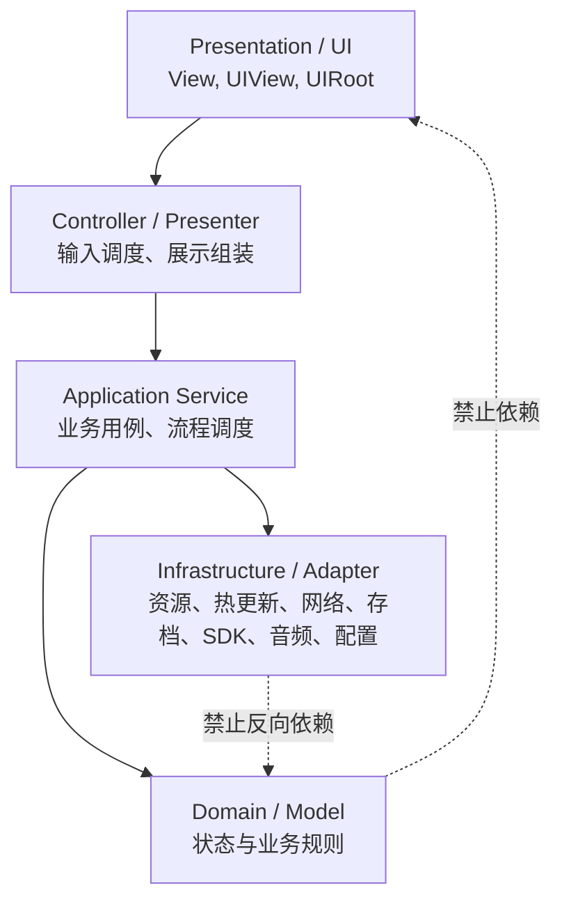
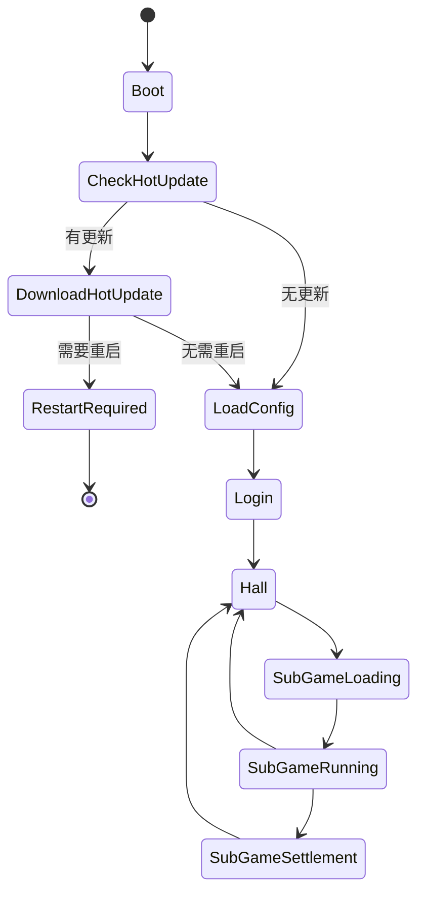
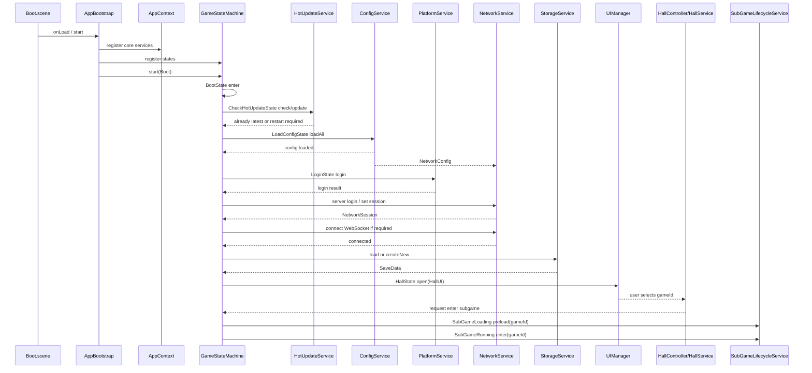

# Cocos Creator 3.8.8 主框架设计总览

本文档是项目框架的总入口，负责说明整体架构图、目录结构、系统边界和系统间依赖关系。各系统的详细设计拆分到 `docs/systems` 目录中维护。

---

## 1. 文档导航

| 文档 | 内容 |
| --- | --- |
| [启动与生命周期](systems/01_BOOTSTRAP_LIFECYCLE.md) | AppBootstrap、AppContext、ServiceToken、启动流程 |
| [错误与日志系统](systems/02_ERROR_LOGGING.md) | FrameworkError、Assert、ErrorReporter、Logger |
| [事件系统](systems/03_EVENT_BUS.md) | EventBus、事件边界、订阅释放 |
| [FSM 状态机系统](systems/04_FSM.md) | StateMachine、GameState、主流程状态 |
| [模块系统](systems/05_MODULE_SYSTEM.md) | ModuleRegistry、Model、Service、Controller、Facade |
| [UI 系统](systems/06_UI_SYSTEM.md) | BaseView、UIView、UIManager、UIRoot、UIHandle |
| [资源系统](systems/07_RESOURCE_SYSTEM.md) | ResourceManager、BundleLoader、PrefabFactory、资源版本、资源释放 |
| [配置系统](systems/08_CONFIG_SYSTEM.md) | ConfigService、ConfigTable、Validator、引用校验 |
| [存档系统](systems/09_STORAGE_SYSTEM.md) | StorageService、SaveData、迁移、Repository |
| [平台适配系统](systems/10_PLATFORM_SYSTEM.md) | PlatformAdapter、PlatformService、平台能力隔离 |
| [音频与计时器系统](systems/11_AUDIO_TIMER_SYSTEM.md) | AudioManager、AudioRoot、TimerService |
| [业务系统设计](systems/12_BUSINESS_SYSTEMS.md) | 背包、货币、关卡、奖励、广告、任务、商城、红点、引导 |
| [热更新系统](systems/13_HOT_UPDATE_SYSTEM.md) | HotUpdateService、Manifest、版本检查、搜索路径适配 |
| [网络层系统](systems/14_NETWORK_SYSTEM.md) | NetworkService、HTTP、WebSocket、心跳重连、消息路由 |
| [大厅与子游戏系统](systems/15_HALL_SUBGAME_SYSTEM.md) | 单 Boot 场景容器、大厅、多子游戏生命周期、GameplayRoot |
| [UI Prefab 制作与绑定生成](systems/16_UI_PREFAB_BINDING.md) | prefab 命名规范、绑定脚本自动生成、生成校验 |
| [基础类完整清单](FRAMEWORK_CLASS_ARCHITECTURE.md) | 所有基础类的详细职责与开发任务 |

---

## 2. 总体架构目标

- 采用模块化架构，系统之间通过稳定接口协作。
- UI 使用 MVC / MVP 分层，禁止业务逻辑写在 UI 脚本中。
- 主流程使用 FSM 状态机，禁止状态之间直接调用内部方法。
- 跨模块通知使用 EventBus，但 EventBus 只做通知，不承载完整业务流程。
- 玩法、道具、关卡、任务、商城、音频、引导等系统全部数据驱动。
- 平台 SDK 必须通过 PlatformAdapter 接入，业务层不得直接调用 SDK。
- 热更新系统只负责版本检查、下载、校验和搜索路径切换，资源加载仍由 ResourceManager 统一执行。
- Manifest 必须通过 `tools/hotupdate/generate-manifest.js` 自动生成，禁止手工维护资源 `md5` 和 `size`。
- 网络层使用 HTTP + WebSocket 混合架构，统一鉴权、协议、错误、心跳、重连和消息路由。
- 大厅 + 多子游戏模式下，`Boot.scene` 只作为单场景运行容器，大厅和子游戏通过模块、配置、UI prefab、玩法 prefab 动态接入。
- 全框架遵循 fail-fast，禁止 fallback、mock 数据兜底、静默失败。

---

## 3. 推荐目录结构

```text
framework/
├─ assets/
│  ├─ scenes/
│  │  └─ Boot.scene
│  ├─ prefabs/
│  │  ├─ ui/
│  │  ├─ gameplay/
│  │  └─ subgames/
│  ├─ resources/
│  │  ├─ configs/
│  │  ├─ hotupdate/
│  │  │  ├─ project.manifest
│  │  │  └─ version.manifest
│  │  ├─ audio/
│  │  ├─ textures/
│  │  └─ prefabs/
│  └─ scripts/
│     ├─ main.ts
│     ├─ core/
│     │  ├─ app/
│     │  │  ├─ AppBootstrap.ts
│     │  │  ├─ AppContext.ts
│     │  │  ├─ ServiceToken.ts
│     │  │  ├─ GameState.ts
│     │  │  ├─ GameStateMachine.ts
│     │  │  └─ states/
│     │  ├─ error/
│     │  ├─ logger/
│     │  ├─ event/
│     │  ├─ fsm/
│     │  ├─ module/
│     │  ├─ ui/
│     │  ├─ resource/
│     │  ├─ hotupdate/
│     │  ├─ network/
│     │  ├─ gameplay/
│     │  ├─ config/
│     │  ├─ storage/
│     │  ├─ audio/
│     │  └─ timer/
│     ├─ platform/
│     ├─ configs/
│     ├─ modules/
│     │  ├─ hall/
│     │  ├─ subgames/
│     │  ├─ bag/
│     │  ├─ currency/
│     │  ├─ level/
│     │  ├─ reward/
│     │  ├─ ad/
│     │  ├─ task/
│     │  ├─ shop/
│     │  ├─ reddot/
│     │  └─ guide/
│     └─ common/
├─ docs/
│  ├─ FRAMEWORK_OVERVIEW.md
│  ├─ FRAMEWORK_CLASS_ARCHITECTURE.md
│  └─ systems/
├─ tools/
│  └─ hotupdate/
│     ├─ generate-manifest.js
│     ├─ hotupdate.config.json
│     └─ README.md
├─ package.json
└─ tsconfig.json
```

目录原则：

- `core` 只提供基础能力，不依赖业务模块。
- `modules` 是业务模块，按模块自治。
- `platform` 只放平台适配接口和实现。
- `configs` 放配置类型定义和配置仓库。
- `common` 只放纯函数工具，禁止演变成万能 Utils。
- `core/hotupdate` 放热更新流程和平台 adapter，不放业务 UI。
- `core/network` 放 HTTP、WebSocket、协议、鉴权、心跳、重连、消息路由。
- `tools/hotupdate` 放 manifest 自动生成工具、生成配置和发布辅助说明。

---

## 4. 整体架构图

```mermaid
flowchart TD
  BootScene["Boot.scene"] --> AppBootstrap["AppBootstrap"]
  AppBootstrap --> AppContext["AppContext"]
  AppBootstrap --> GameStateMachine["GameStateMachine"]

  AppContext --> Logger["Logger"]
  AppContext --> ErrorReporter["ErrorReporter"]
  AppContext --> EventBus["EventBus"]
  AppContext --> ResourceManager["ResourceManager"]
  AppContext --> HotUpdateService["HotUpdateService"]
  AppContext --> NetworkService["NetworkService"]
  AppContext --> ConfigService["ConfigService"]
  AppContext --> StorageService["StorageService"]
  AppContext --> UIManager["UIManager"]
  AppContext --> PlatformService["PlatformService"]
  AppContext --> AudioManager["AudioManager"]
  AppContext --> TimerService["TimerService"]
  AppContext --> ModuleRegistry["ModuleRegistry"]

  GameStateMachine --> BootState["BootState"]
  GameStateMachine --> CheckHotUpdateState["CheckHotUpdateState"]
  GameStateMachine --> DownloadHotUpdateState["DownloadHotUpdateState"]
  GameStateMachine --> RestartRequiredState["RestartRequiredState"]
  GameStateMachine --> LoadConfigState["LoadConfigState"]
  GameStateMachine --> LoginState["LoginState"]
  GameStateMachine --> HallState["HallState"]
  GameStateMachine --> SubGameLoadingState["SubGameLoadingState"]
  GameStateMachine --> SubGameRunningState["SubGameRunningState"]
  GameStateMachine --> SubGameSettlementState["SubGameSettlementState"]

  UIManager --> UIRoot["UIRoot"]
  UIManager --> ResourceManager
  UIManager --> UIView["UIView / BaseView"]
  SubGameLifecycleService["SubGameLifecycleService"] --> SubGameRegistry["SubGameRegistry"]
  SubGameLifecycleService --> GameplayRootService["GameplayRootService"]
  SubGameLifecycleService --> ResourceManager

  UIView --> Controller["Controller"]
  Controller --> Service["Service"]
  Service --> Model["Model"]
  Service --> EventBus
  Service --> ConfigService
  Service --> StorageService
  Service --> PlatformService
  Service --> NetworkService

  NetworkService --> HttpClient["HttpClient"]
  NetworkService --> WebSocketClient["WebSocketClient"]
  NetworkService --> NetworkProtocolCodec["NetworkProtocolCodec"]
  NetworkService --> NetworkMessageRouter["NetworkMessageRouter"]
  ResourceManager --> BundleLoader["BundleLoader"]
  ResourceManager --> PrefabFactory["PrefabFactory"]
  ResourceManager --> ResourceVersionProvider["ResourceVersionProvider"]
  HotUpdateService --> HotUpdateAdapter["HotUpdateAdapter"]
  HotUpdateService --> HotUpdateSearchPathService["HotUpdateSearchPathService"]
  HotUpdateSearchPathService --> ResourceVersionProvider
  ConfigService --> ConfigValidator["ConfigValidator"]
  ConfigService --> ConfigTable["ConfigTable"]
  StorageService --> SaveMigration["SaveMigrationPipeline"]
  PlatformService --> PlatformAdapter["PlatformAdapter"]
```



---

## 5. 分层依赖图



核心规则：

- View 不直接读写 Model。
- View 不直接读写存档。
- View 不直接请求 SDK。
- Service 不直接操作 UI 节点。
- Model 不依赖 Cocos Component、SDK、存储、网络。
- Adapter 不反向调用业务模块。
- 热更新系统不直接加载业务资源，ResourceManager 不直接下载更新资源。
- 网络层不直接修改业务 Model，不直接操作 UI，不直接读写存档。

---

## 6. 主流程状态图



状态职责：

| 状态 | 职责 | 禁止 |
| --- | --- | --- |
| Boot | 初始化框架基础服务 | 不写业务初始化细节 |
| CheckHotUpdate | 检查远端资源版本 | 不下载业务资源，不伪装成功 |
| DownloadHotUpdate | 下载、校验、应用热更新资源 | 不继续进入游戏主流程，除非明确无需重启 |
| RestartRequired | 显示重启提示并停止主流程 | 不静默跳过重启 |
| LoadConfig | 加载并校验配置 | 不补默认配置 |
| Login | 平台登录、服务端登录、WebSocket 建连、读取或创建存档 | 不直接调用 SDK，不静默创建空存档，不吞网络失败 |
| Hall | 打开大厅界面，等待用户选择子游戏 | 不加载子游戏玩法资源 |
| SubGameLoading | 校验 `gameId`，加载子游戏配置和资源 | 不静默跳过缺失配置或资源 |
| SubGameRunning | 创建并运行当前子游戏 | 不直接发奖励或修改存档 |
| SubGameSettlement | 编排结算、奖励、任务进度，返回 Hall | 不直接改背包 Model 或子游戏内部 Model |

---

## 7. 系统依赖矩阵

| 系统 | 允许依赖 | 对外提供 | 禁止依赖 |
| --- | --- | --- | --- |
| 启动生命周期 | error、logger、event、fsm、各 core service | AppContext、启动流程 | 具体业务逻辑 |
| 错误与日志 | 无或最小基础类型 | FrameworkError、Assert、Logger | UI、业务模块 |
| 事件系统 | error、app disposable | EventBus、EventSubscription | 具体业务流程 |
| FSM | error、logger、event | StateMachine、GameStateMachine | UI 节点、具体业务实现 |
| 模块系统 | app、event、timer、resource 可选 | ModuleRegistry、BaseModule、BaseModel、BaseService | 具体 UI 实现 |
| UI 系统 | resource、event、error、timer 可选 | UIManager、BaseView、UIRoot | 业务 Model、Storage、SDK |
| 资源系统 | error、logger、ResourceVersionProvider | ResourceManager、BundleLoader | UI 业务、业务模块、热更新下载流程 |
| 配置系统 | resource、error、logger | ConfigService、ConfigTable | 业务运行状态 |
| 存档系统 | error、logger | StorageService、SaveRepository | UI、SDK |
| 平台系统 | error、logger | PlatformService、PlatformAdapter | 业务奖励、UI |
| 音频系统 | resource、config、error | AudioManager | 业务决策 |
| 计时器系统 | error、logger | TimerService、TimerHandle | 业务规则 |
| 热更新系统 | error、logger、event、platform/native、resource search path | HotUpdateService、HotUpdateAdapter、ResourceVersionProvider 实现 | 业务模块、UI 具体实现、资源引用计数 |
| 网络层系统 | error、logger、event、timer、config、auth token provider | NetworkService、HttpClient、WebSocketClient、MessageRouter | UI、业务 Model、Storage 具体实现、Platform SDK |
| 大厅与子游戏系统 | FSM、module、resource、ui、config、event | HallModule、SubGameRegistry、SubGameLifecycleService、GameplayRootService | 超级 Manager、直接改其他模块 Model、EventBus 串完整流程 |
| 业务系统 | core 稳定接口 | 各模块 Service / Facade | 其他模块内部 Model |

---

## 8. 初始化时序



---

## 9. 系统间通信规则

### 9.1 同模块内部

```text
View -> Controller -> Service -> Model
```

- View 只转发输入和展示数据。
- Controller 只做交互调度。
- Service 执行业务规则。
- Model 保存状态。

### 9.2 跨模块调用

允许：

- 通过模块 Facade 调用明确 API。
- 通过 EventBus 发通知。
- 通过 Service 查询 Config、Storage、Platform 等 core 能力。
- ResourceManager 通过 ResourceVersionProvider 获取资源版本和搜索路径。
- 业务 Service 通过 NetworkService 调用 HTTP API 或 WebSocket 消息。

禁止：

- 一个模块直接修改另一个模块 Model。
- 一个模块直接访问另一个模块 View。
- 用 EventBus 串完整业务流程。
- 通过全局单例偷拿内部对象。
- 热更新系统直接替换已加载业务资源。
- 业务模块直接使用 `fetch`、`XMLHttpRequest`、`new WebSocket`。

---

## 10. Cocos Creator 3.8.8 相关落地规则

- 所有 Cocos 组件类使用 `@ccclass` 注册。
- 需要编辑器绑定的节点使用 `@property(Node)`，缺失时在 `onLoad` fail-fast。
- UI 根节点、音频根节点、启动根节点由场景显式放置和绑定。
- 大厅 + 多子游戏模式下，`GameplayRoot` 必须由场景显式放置和绑定，缺失时启动失败。
- 资源加载统一经过 `ResourceManager`，UI prefab 再由 `UIManager` 管理。
- 热更新只在支持的平台执行，原生平台可通过 `jsb.AssetsManager` 封装，Web/小游戏必须走各自平台策略或明确 Unsupported。
- 热更新搜索路径由 `HotUpdateSearchPathService` 管理，`ResourceManager` 只读取当前有效资源版本和搜索路径。
- HTTP 和 WebSocket 统一封装在 `NetworkService`，业务层禁止直接创建请求或长连接。
- release 环境网络地址必须使用 HTTPS / WSS，网络配置必须统一校验。
- 本地存储统一通过 `StorageService` 访问 `sys.localStorage`。
- 业务层尽量保持 TypeScript 纯类，减少对 Cocos 运行环境依赖，方便单测。

---

## 11. 开发阶段建议

| 阶段 | 目标 | 文档 |
| --- | --- | --- |
| P0 | 启动闭环和状态机可跑 | 启动、错误日志、事件、FSM |
| P1 | UI、资源、配置闭环 | UI、资源、配置 |
| P2 | 存档、平台、网络、音频、计时器、热更新 | 存档、平台、网络、音频计时器、热更新 |
| P3 | 建立可复制业务模块 | 模块系统、业务系统 |
| P4 | 大厅 + 多子游戏运行闭环 | FSM、大厅与子游戏系统、资源、配置 |

建议先做 P0，再做一个最小大厅示例验证全链路。热更新建议在 P2 接入，但 ResourceManager 从 P1 开始就预留 `ResourceVersionProvider`。大厅 + 多子游戏模式建议在 P4 接入：先跑通 `Hall -> SubGameLoading -> SubGameRunning -> SubGameSettlement -> Hall`，再扩展具体子游戏。
