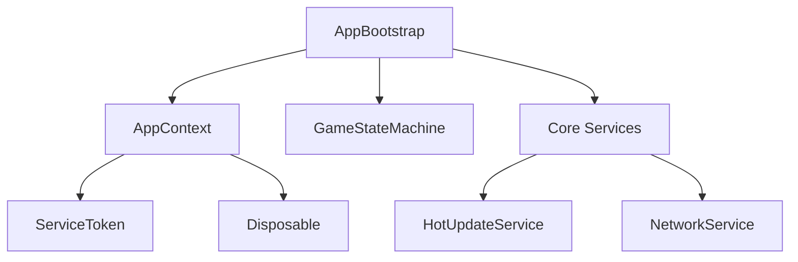
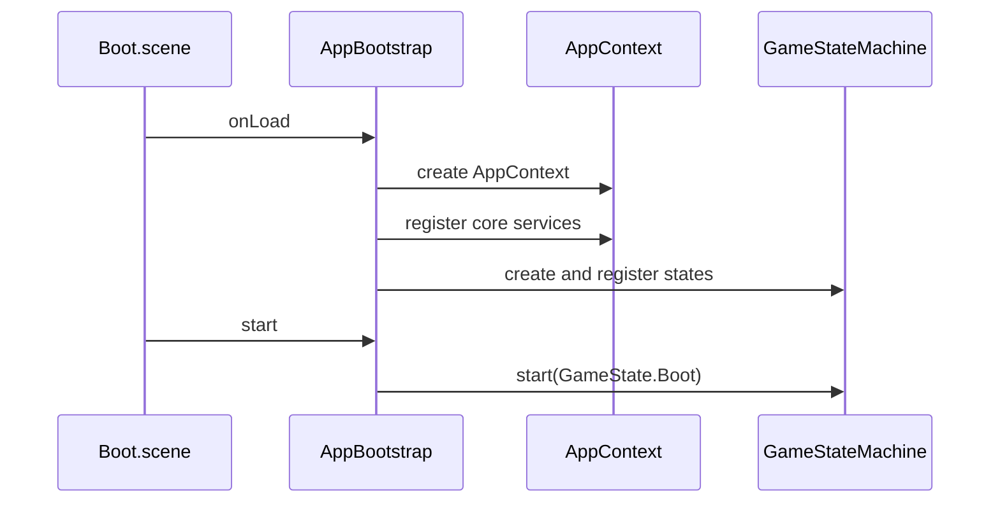

# 启动与生命周期系统设计

## 1. 系统定位

启动与生命周期系统负责把 Cocos 启动场景接入框架运行时，创建框架依赖上下文，并启动主流程状态机。它是框架入口，不是业务逻辑入口。

## 2. 核心职责

- 创建并持有 `AppContext`。
- 初始化核心服务：Logger、EventBus、ResourceManager、HotUpdateService、NetworkService、ConfigService、StorageService、UIManager、PlatformService、AudioManager、TimerService、ModuleRegistry。
- 注册主流程状态机。
- 驱动主流程从 `BootState` 开始。
- 在销毁时释放所有框架资源。
- 大厅 + 多子游戏模式下，显式绑定并校验 `GameplayRoot`。

## 3. 核心类

| 类 | 路径 | 功能 |
| --- | --- | --- |
| `AppBootstrap` | `assets/scripts/core/app/AppBootstrap.ts` | Cocos 启动组件，挂在 Boot 场景根节点 |
| `AppContext` | `assets/scripts/core/app/AppContext.ts` | 框架依赖容器 |
| `ServiceToken` | `assets/scripts/core/app/ServiceToken.ts` | 类型安全的依赖注册 key |
| `Disposable` | `assets/scripts/core/app/Disposable.ts` | 统一释放协议 |
| `CoreTokens` | `assets/scripts/core/app/CoreTokens.ts` | 核心服务 token 集合 |

## 4. 依赖关系

允许依赖：

- error
- logger
- event
- fsm
- resource
- hotupdate
- network
- config
- storage
- ui
- platform
- audio
- timer
- module

禁止依赖：

- 具体业务模块内部实现。
- 具体 UI prefab 业务路径。
- 第三方 SDK 实现类的直接调用。

## 5. 启动流程

## 6. Fail-Fast 规则

- `AppContext` 重复注册 token 直接抛错。
- 查询未注册 token 直接抛错。
- dispose 后继续访问上下文直接抛错。
- `AppBootstrap` 重复启动直接抛错。
- 主状态机启动失败必须暴露错误。
- `UIRoot`、`AudioRoot`、`GameplayRoot` 等场景根节点缺失时直接抛错。

## 7. 开发任务

1. 创建 `assets/scripts/core/app` 目录。
2. 实现 `Disposable`。
3. 实现 `ServiceToken` 与 `CoreTokens`。
4. 实现 `AppContext`。
5. 实现 `AppBootstrap`。
6. 注册 `HotUpdateService` 和 `ResourceVersionProvider`。
7. 注册 `NetworkService`，但不在 AppBootstrap 中直接发起连接。
8. 在 Cocos 中创建 `Boot.scene` 并挂载 `AppBootstrap`。
9. 接入 `GameStateMachine`。
10. 大厅 + 多子游戏模式下，在 `Boot.scene` 增加 `GameplayRoot` 并注册 `GameplayRootService`。

## 8. 验收标准

- Boot 场景能创建框架上下文。
- 核心服务能通过 token 注册和获取。
- 缺少任意核心依赖时启动失败且错误清晰。
- `AppBootstrap` 不包含具体业务逻辑。
- `AppBootstrap` 只绑定根节点，不直接打开大厅或创建子游戏。

