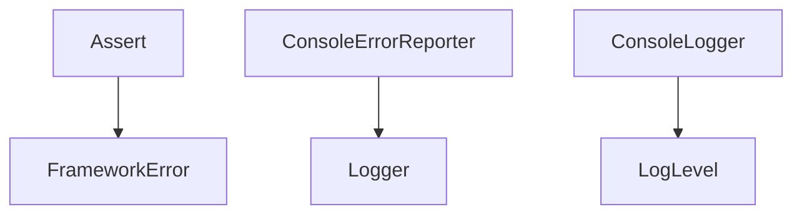

# 错误与日志系统设计

## 1. 系统定位

错误与日志系统负责统一 fail-fast、错误上下文和日志输出。它不负责恢复业务，也不把错误变成默认值。

## 2. 核心职责

- 提供统一错误类型 `FrameworkError`。
- 提供断言工具 `Assert`。
- 提供错误上报接口 `ErrorReporter`。
- 提供日志接口 `Logger` 与控制台实现 `ConsoleLogger`。

## 3. 核心类

| 类 | 路径 | 功能 |
| --- | --- | --- |
| `FrameworkError` | `assets/scripts/core/error/FrameworkError.ts` | 统一框架错误类型 |
| `Assert` | `assets/scripts/core/error/Assert.ts` | fail-fast 断言工具 |
| `ErrorReporter` | `assets/scripts/core/error/ErrorReporter.ts` | 错误上报接口 |
| `ConsoleErrorReporter` | `assets/scripts/core/error/ConsoleErrorReporter.ts` | 控制台错误输出实现 |
| `Logger` | `assets/scripts/core/logger/Logger.ts` | 日志接口 |
| `ConsoleLogger` | `assets/scripts/core/logger/ConsoleLogger.ts` | 控制台日志实现 |
| `LogLevel` | `assets/scripts/core/logger/LogLevel.ts` | 日志等级 |

## 4. 依赖关系



允许依赖：

- TypeScript 基础类型。
- Cocos `error` / `warn` / `log` 可选封装。

禁止依赖：

- UI 系统。
- 业务模块。
- SDK。
- 存档系统。

## 5. 错误信息规范

错误消息必须包含：

- 模块名。
- 错误码。
- 失败原因。
- 关键参数。
- 当前状态或上下文。

示例：

```text
[ConfigService][MissingTable] Missing config table: item_config, state=LoadConfig
```

## 6. Fail-Fast 规则

- 禁止 `catch` 后返回空数组、空对象、默认值。
- 禁止 `warn` 后继续执行 fatal 问题。
- 缺节点、缺资源、缺配置、非法状态必须抛错。
- SDK 调用失败必须向上暴露。

## 7. 开发任务

1. 实现 `FrameworkError`。
2. 实现 `Assert.notNull`、`Assert.isTrue`、`Assert.nonEmptyString`、`Assert.validState`。
3. 实现 `Logger` 与 `ConsoleLogger`。
4. 实现 `ErrorReporter`。
5. 所有 core 服务统一使用错误系统。

## 8. 验收标准

- 任意基础服务抛错都能定位模块。
- 没有 fallback 工具函数。
- 日志不能替代错误抛出。
