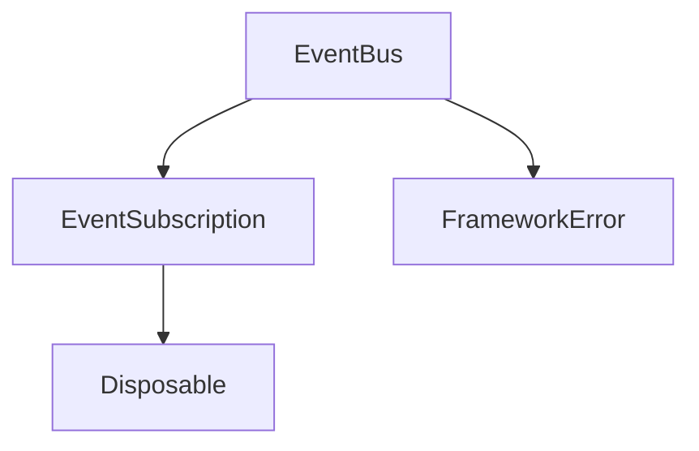
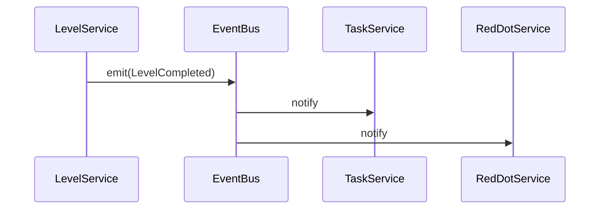

# 事件系统设计

## 1. 系统定位

事件系统只用于跨模块通知。它不是业务流程引擎，不能替代函数调用，也不能隐式修改其他模块数据。

## 2. 核心职责

- 注册事件监听。
- 释放事件监听。
- 派发事件 payload。
- 支持 once 监听。
- 在监听器异常时暴露错误。

## 3. 核心类

| 类 | 路径 | 功能 |
| --- | --- | --- |
| `EventBus` | `assets/scripts/core/event/EventBus.ts` | 事件总线主体 |
| `EventSubscription` | `assets/scripts/core/event/EventSubscription.ts` | 事件订阅句柄 |
| `EventHandler` | `assets/scripts/core/event/EventHandler.ts` | 监听函数类型 |
| `AppEventMap` | `assets/scripts/core/event/AppEventMap.ts` | 系统级事件定义 |

## 4. 依赖关系

允许依赖：

- app/Disposable。
- error。
- logger 可选。

禁止依赖：

- 具体业务 Service。
- UI 节点。
- 存档系统。
- SDK。

## 5. 使用边界

适合：

- 金币变化通知 UI 刷新。
- 背包变化通知红点系统。
- 关卡完成通知任务系统。
- 配置加载完成通知。
- 状态切换通知。

不适合：

- 用 EventBus 串完整购买流程。
- 用 EventBus 替代 Service 方法调用。
- 用 EventBus 让其他模块偷偷改数据。

## 6. 事件流示例

## 7. Fail-Fast 规则

- 派发未定义事件直接抛错。
- 监听器执行失败必须暴露。
- dispose 后的订阅不可再次触发。
- 事件 payload 类型必须明确。

## 8. 开发任务

1. 定义泛型事件 map。
2. 实现 `on`、`once`、`off`、`emit`、`clear`。
3. 注册返回 `EventSubscription`。
4. 派发时复制监听器快照。
5. 每个模块维护自己的 `*Events.ts`。

## 9. 验收标准

- 事件只做通知。
- 模块销毁时能释放订阅。
- 异常不会静默丢失。
