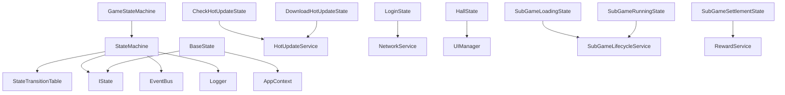
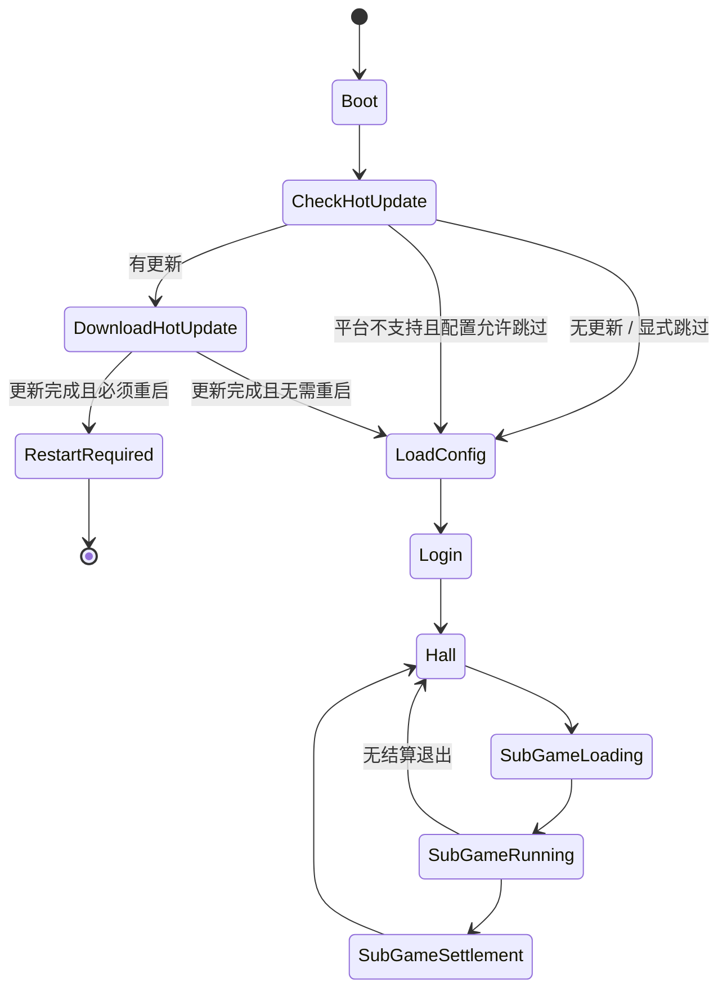

# FSM 状态机系统设计

## 1. 系统定位

FSM 系统负责管理主流程状态切换。状态只负责编排流程，复杂业务交给对应 Service。

热更新接入后，主流程需要在配置加载前完成版本检查和必要资源更新，避免旧配置读取到新资源或新配置引用旧资源。

## 2. 核心职责

- 注册状态。
- 校验状态转移是否合法。
- 按顺序执行 exit / enter。
- 提供当前状态查询。
- 将主流程从 Boot 推进到热更新检查、配置加载、登录、大厅、子游戏加载、子游戏运行、子游戏结算。

## 3. 核心类

| 类 | 路径 | 功能 |
| --- | --- | --- |
| `IState` | `assets/scripts/core/fsm/IState.ts` | 状态接口 |
| `BaseState` | `assets/scripts/core/fsm/BaseState.ts` | 状态基类 |
| `StateMachine` | `assets/scripts/core/fsm/StateMachine.ts` | 通用状态机 |
| `StateTransitionTable` | `assets/scripts/core/fsm/StateTransitionTable.ts` | 状态转移表 |
| `GameState` | `assets/scripts/core/app/GameState.ts` | 主流程状态枚举 |
| `GameStateMachine` | `assets/scripts/core/app/GameStateMachine.ts` | 主流程状态机封装 |

## 4. 主状态

| 状态 | 职责 |
| --- | --- |
| `BootState` | 校验基础服务，进入热更新检查 |
| `CheckHotUpdateState` | 检查热更新支持情况和远端版本 |
| `DownloadHotUpdateState` | 下载、校验、应用热更新资源 |
| `RestartRequiredState` | 阻断继续进入游戏，提示用户重启 |
| `LoadConfigState` | 加载并校验所有配置 |
| `LoginState` | 平台登录、服务端登录、WebSocket 建连、存档读取或新用户创建 |
| `HallState` | 打开大厅界面，等待用户选择子游戏 |
| `SubGameLoadingState` | 校验 `gameId`，加载子游戏配置、UI 和玩法资源 |
| `SubGameRunningState` | 创建并运行当前子游戏，接收退出结果 |
| `SubGameSettlementState` | 编排子游戏结算、奖励、任务进度，返回大厅 |

兼容说明：

- `HomeState`、`BattleState`、`SettlementState` 可作为早期单玩法命名保留。
- 大厅 + 多子游戏模式下，建议迁移为 `HallState`、`SubGameLoadingState`、`SubGameRunningState`、`SubGameSettlementState`，避免把某个单玩法概念固化进主流程。

## 5. 依赖关系

允许依赖：

- app/context。
- error。
- logger。
- event。
- hotupdate。
- network。
- 状态中可以通过 Service 调用业务能力。

禁止依赖：

- 状态之间直接调用内部方法。
- 状态直接操作 UI 节点。
- 状态直接修改 Model。
- 状态吞掉切换错误。
- 热更新失败后自动进入 LoadConfig。
- 网络登录失败后自动进入 Hall。
- 状态直接创建子游戏节点。
- 状态直接发奖励或修改子游戏 Model。

## 6. 状态转移图

## 7. Fail-Fast 规则

- 未注册状态不能切换。
- 重复注册状态直接抛错。
- 非法状态转移直接抛错。
- enter / exit 失败直接向上抛错。
- 切换过程中再次切换必须报错或使用明确队列策略。
- 热更新失败不能默认进入 LoadConfig。
- 热更新完成且要求重启时不能继续进入 Login / Hall。
- 服务端登录失败或 WebSocket 必需连接失败时不能继续进入 Hall。
- `gameId` 缺失或未注册时不能进入 `SubGameLoadingState`。
- 子游戏加载失败不能进入 `SubGameRunningState`。
- 子游戏退出清理失败不能静默返回大厅。

## 8. 开发任务

1. 实现 `IState`。
2. 实现 `BaseState`。
3. 实现 `StateTransitionTable`。
4. 实现 `StateMachine`。
5. 定义 `GameState`，包含热更新状态。
6. 实现 `GameStateMachine`。
7. 实现 `BootState`、`CheckHotUpdateState`、`DownloadHotUpdateState`、`RestartRequiredState`。
8. 实现 `LoadConfigState`、`LoginState`、`HallState`、`SubGameLoadingState`、`SubGameRunningState`、`SubGameSettlementState`。
9. 在状态转移表中显式声明所有允许转移。
10. 在 `LoginState` 中通过 `NetworkService` 完成服务端登录和必要的 WebSocket 建连。
11. 在 `SubGameLoadingState` 中校验子游戏配置和模块注册。
12. 在 `SubGameRunningState` 中只编排生命周期，不直接写具体子游戏业务。

## 9. 验收标准

- 主流程可按规则从 Boot 进入热更新检查，再进入 LoadConfig 或 RestartRequired。
- 登录成功后进入大厅，不能直接进入固定子游戏。
- 大厅能通过合法状态转移进入子游戏加载、运行、结算并回到大厅。
- 非法转移能被阻止。
- 状态切换日志清晰。
- 热更新失败不会被静默跳过。
