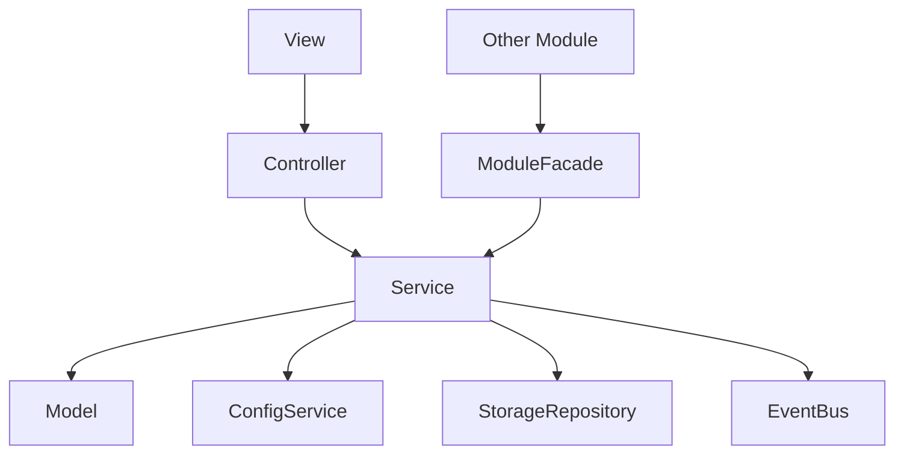

# 模块系统设计

## 1. 系统定位

模块系统负责约束业务模块结构，确保业务数据、规则、交互调度和显示分离。它提供模块生命周期和基础类，但不提供具体业务逻辑。

## 2. 模块标准结构

```text
modules/example/
├─ ExampleModule.ts
├─ ExampleModel.ts
├─ ExampleService.ts
├─ ExampleController.ts
├─ ExampleView.ts
├─ ExampleTypes.ts
├─ ExampleEvents.ts
├─ ExampleConfigRepository.ts
└─ index.ts
```

大厅 + 子游戏模式推荐结构：

```text
modules/hall/
├─ HallModule.ts
├─ HallModel.ts
├─ HallService.ts
├─ HallController.ts
├─ HallView.ts
├─ HallTypes.ts
├─ HallEvents.ts
└─ index.ts

modules/subgames/<gameId>/
├─ <GameName>Module.ts
├─ <GameName>Model.ts
├─ <GameName>Service.ts
├─ <GameName>Controller.ts
├─ <GameName>View.ts
├─ <GameName>ResourceService.ts
├─ <GameName>Types.ts
├─ <GameName>Events.ts
└─ index.ts
```

## 3. 核心类

| 类 | 路径 | 功能 |
| --- | --- | --- |
| `IModule` | `assets/scripts/core/module/IModule.ts` | 模块生命周期接口 |
| `BaseModule` | `assets/scripts/core/module/BaseModule.ts` | 模块基类，统一释放资源 |
| `ModuleRegistry` | `assets/scripts/core/module/ModuleRegistry.ts` | 模块注册和初始化 |
| `BaseModel` | `assets/scripts/core/module/BaseModel.ts` | 模块状态基类 |
| `BaseService` | `assets/scripts/core/module/BaseService.ts` | 业务逻辑基类 |
| `BaseController` | `assets/scripts/core/module/BaseController.ts` | UI 交互调度基类 |
| `ModuleFacade` | `assets/scripts/core/module/ModuleFacade.ts` | 模块对外 API 协议 |

## 4. 依赖关系



允许依赖：

- Service 依赖 Model、Config、StorageRepository、EventBus、PlatformService、其他模块 Facade。
- Controller 依赖 Service 和 View 接口。
- View 依赖 Controller。

禁止依赖：

- Model 依赖 View。
- Service 直接操作 UI 节点。
- View 直接读写存档。
- 模块直接访问其他模块内部 Model。

## 5. 跨模块协作

推荐方式：

- 读写能力通过目标模块 Facade 暴露。
- 状态变化通过 EventBus 通知。
- 大厅进入子游戏通过 FSM 和 `SubGameLifecycleService` 编排。
- 子游戏向结算流程返回 `SubGameExitResult`，不直接修改奖励、背包、货币模块内部状态。

禁止方式：

- 直接 import 对方 Model 后修改。
- 通过全局单例偷拿 Service。
- 用 EventBus 完成整条业务流程。
- 大厅直接创建子游戏节点。
- 子游戏直接操作大厅 View 或大厅 Model。

## 6. 大厅与子游戏模块边界

大厅模块职责：

- 展示玩家信息、货币和子游戏入口。
- 根据 `subgame_config` 展示可进入的子游戏。
- 将用户点击转换为明确的进入请求。

大厅模块禁止：

- 直接加载子游戏资源。
- 直接实例化子游戏 prefab。
- 直接修改子游戏内部 Model。

子游戏模块职责：

- 管理自己的玩法状态、玩法 UI 和玩法资源。
- 实现统一子游戏生命周期协议。
- 退出时返回明确结果给结算流程。

子游戏模块禁止：

- 绕过结算流程直接发最终奖励。
- 直接修改大厅、背包、货币、任务等模块内部 Model。
- 使用 `cc.find` 查找 `GameplayRoot` 或大厅节点。

## 7. Fail-Fast 规则

- 重复注册模块名直接抛错。
- 查询不存在模块直接抛错。
- 模块初始化失败不继续启动。
- Controller 未绑定 View 时调用 View 直接抛错。
- 子游戏模块未注册但配置引用了该 `gameId` 时直接抛错。
- 子游戏重复注册同一 `gameId` 时直接抛错。

## 8. 开发任务

1. 实现模块基础接口和基类。
2. 实现 `ModuleRegistry`。
3. 实现事件订阅和 timer 的统一 track 释放。
4. 建立 Example 模块作为模板。
5. 后续业务模块严格按模板创建。
6. 新增 Hall 模块模板。
7. 新增 SubGame 模块模板，并接入统一生命周期协议。

## 9. 验收标准

- 新模块可以复制模板快速建立。
- Service 可单测。
- UI 不包含业务规则。
- 模块之间没有内部状态穿透。
- 大厅和子游戏之间只通过明确请求、Facade、FSM 参数或结算结果协作。
