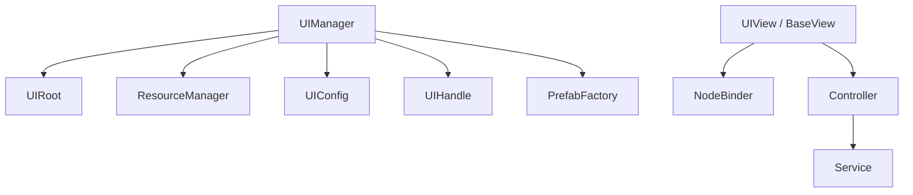
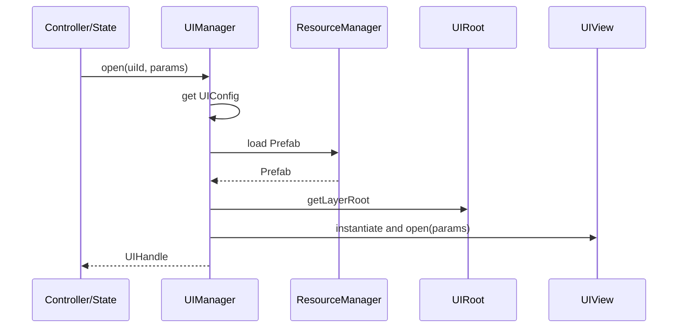

# UI 系统设计

## 1. 系统定位

UI 系统负责界面显示、UI prefab 打开关闭、层级管理、View 生命周期和节点绑定校验。UI 系统不负责业务规则。

## 2. 核心职责

- 统一打开和关闭 UI。
- 统一加载 UI prefab。
- 管理 UI 层级。
- 管理 UI 缓存。
- View 只负责显示、输入转发、动画。
- Controller 负责交互调度。

## 3. 核心类

| 类 | 路径 | 功能 |
| --- | --- | --- |
| `BaseView` | `assets/scripts/core/ui/BaseView.ts` | Cocos View 基类 |
| `UIView` | `assets/scripts/core/ui/UIView.ts` | 标准面板 View 基类 |
| `BasePresenter` | `assets/scripts/core/ui/BasePresenter.ts` | MVP 展示数据组装 |
| `UIManager` | `assets/scripts/core/ui/UIManager.ts` | UI 打开关闭和层级管理 |
| `UIConfig` | `assets/scripts/core/ui/UIConfig.ts` | UI 配置 |
| `UILayer` | `assets/scripts/core/ui/UILayer.ts` | UI 层级枚举 |
| `UIRoot` | `assets/scripts/core/ui/UIRoot.ts` | UI 根节点组件 |
| `UIHandle` | `assets/scripts/core/ui/UIHandle.ts` | UI 打开句柄 |
| `NodeBinder` | `assets/scripts/core/ui/NodeBinder.ts` | 节点绑定校验 |
| `ToastService` | `assets/scripts/core/ui/ToastService.ts` | 轻提示服务 |
| `LoadingService` | `assets/scripts/core/ui/LoadingService.ts` | 加载遮罩服务 |

## 4. UI 层级

```text
UIRoot
├─ Background
├─ Normal
├─ Popup
├─ Top
└─ System
```

## 5. 依赖关系



允许依赖：

- resource。
- event。
- timer。
- error。
- Controller 接口。

禁止依赖：

- 业务 Model。
- StorageService。
- PlatformService / SDK。
- 直接 `resources.load`。
- 随意 `find` / `cc.find`。

## 6. 打开 UI 流程



## 7. Fail-Fast 规则

- UI id 未注册直接抛错。
- prefab 路径为空直接抛错。
- prefab 加载失败直接抛错。
- prefab 根节点缺少 View 组件直接抛错。
- UIRoot 层级节点未绑定直接抛错。
- View 必要节点未绑定直接抛错。

## 8. 开发任务

1. 创建 `UIRoot` 场景节点和五个层级节点。
2. 实现 `UILayer`。
3. 实现 `UIConfig` 注册表。
4. 实现 `BaseView` 和 `UIView`。
5. 实现 `NodeBinder`。
6. 实现 `UIManager`。
7. 做一个 Hall UI 验证链路；大厅 + 多子游戏模式下，子游戏 UI 仍必须通过 UIManager 打开。

## 9. 验收标准

- 所有 UI prefab 只能由 UIManager 打开。
- View 里没有核心业务规则。
- 缺节点能在 onLoad 阶段立刻发现。
