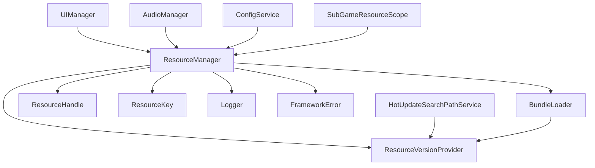
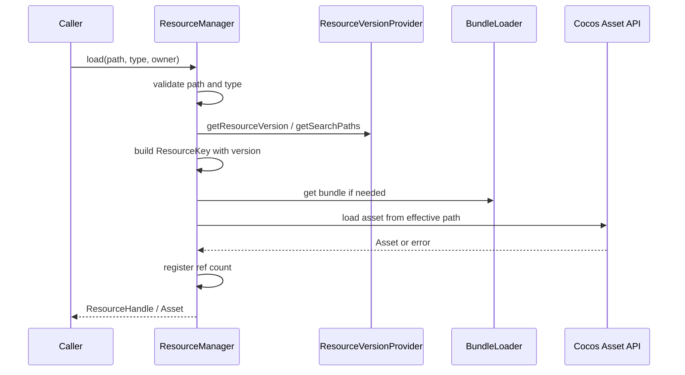
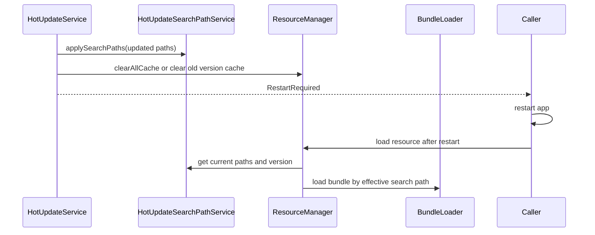

# 资源系统设计

## 1. 系统定位

资源系统负责统一加载、缓存、引用计数和释放 Cocos 资源。业务代码不得散落直接调用 `resources.load` 或 `assetManager.loadBundle`。

接入热更新后，资源系统还需要感知当前有效资源版本和搜索路径，但它不负责检查版本、下载资源或更新 manifest。热更新下载与版本切换由 [热更新系统](13_HOT_UPDATE_SYSTEM.md) 负责，资源系统只负责“按当前有效版本加载资源”。

## 2. 核心职责

- 统一加载资源。
- 统一释放资源。
- 管理 Asset Bundle。
- 管理缓存和引用计数。
- 支持预加载。
- 按 owner 释放资源。
- 读取当前资源版本。
- 读取热更新后的搜索路径。
- 在资源版本变化时清理旧版本缓存。

## 3. 不负责的事情

- 不检查远端版本。
- 不下载热更新资源。
- 不生成 manifest。
- 不直接修改原生搜索路径。
- 不处理 UI 业务。
- 不提供默认资源兜底。

---

## 4. 核心类

| 类 | 路径 | 功能 |
| --- | --- | --- |
| `ResourceManager` | `assets/scripts/core/resource/ResourceManager.ts` | 资源加载和释放入口 |
| `ResourceHandle` | `assets/scripts/core/resource/ResourceHandle.ts` | 资源持有句柄 |
| `ResourceKey` | `assets/scripts/core/resource/ResourceKey.ts` | 资源唯一键，需包含版本信息 |
| `ResourceVersionProvider` | `assets/scripts/core/resource/ResourceVersionProvider.ts` | 当前资源版本和搜索路径接口 |
| `BundleLoader` | `assets/scripts/core/resource/BundleLoader.ts` | Bundle 加载和缓存 |
| `PrefabFactory` | `assets/scripts/core/resource/PrefabFactory.ts` | Prefab 实例化封装 |
| `SubGameResourceScope` | `assets/scripts/core/gameplay/SubGameResourceScope.ts` | 子游戏资源 owner 和批量释放 |

---

## 5. 依赖关系



允许依赖：

- error。
- logger。
- Cocos `resources`、`assetManager`、`Asset`、`Prefab`、`JsonAsset`、`SpriteFrame`、`AudioClip`。
- `ResourceVersionProvider` 接口。

禁止依赖：

- UI 业务。
- 业务模块逻辑。
- HotUpdateService 完整流程。
- 配置默认值兜底。
- 默认资源兜底。

关键边界：

- `ResourceManager` 可以依赖 `ResourceVersionProvider`。
- `ResourceManager` 不直接依赖 `HotUpdateService`。
- `HotUpdateSearchPathService` 实现 `ResourceVersionProvider`。

---

## 6. 关键接口建议

### 6.1 `ResourceVersionProvider`

```ts
export interface ResourceVersionProvider {
  getResourceVersion(): string
  getSearchPaths(): readonly string[]
}
```

说明：

- 未启用热更新时，版本可以来自包内 manifest 或应用版本配置。
- 启用热更新时，版本来自热更新系统持久化的当前有效版本。
- 搜索路径来自 `HotUpdateSearchPathService`。

### 6.2 `ResourceKey`

```ts
export interface ResourceKey {
  readonly bundle?: string
  readonly path: string
  readonly typeName: string
  readonly version: string
}
```

说明：

- `version` 用于避免热更新前后资源缓存混淆。
- 同 bundle、同 path、同 type，但 version 不同，必须视为不同缓存 key。

### 6.3 `ResourceManager`

```ts
export class ResourceManager {
  init(versionProvider: ResourceVersionProvider): void
  load<T extends Asset>(path: string, type: AssetType<T>, options?: LoadOptions): Promise<T>
  loadFromBundle<T extends Asset>(bundleName: string, path: string, type: AssetType<T>): Promise<T>
  preload(path: string, type: AssetType<Asset>): Promise<void>
  retain(asset: Asset, reason: string): void
  release(asset: Asset, reason: string): void
  releaseByOwner(ownerId: string): void
  clearCacheForVersion(version: string): void
  clearAllCache(reason: string): void
}
```

### 6.4 `BundleLoader`

```ts
export class BundleLoader {
  init(versionProvider: ResourceVersionProvider): void
  loadBundle(bundleName: string): Promise<AssetManager.Bundle>
  getBundle(bundleName: string): AssetManager.Bundle
  releaseBundle(bundleName: string): void
  clearBundleCacheForVersion(version: string): void
}
```

---

## 7. 普通资源加载流程



---

## 8. 热更新后资源加载流程



原则：

- 热更新完成并要求重启时，不继续加载业务资源。
- 如果项目允许不重启热切资源，必须先释放旧资源和 bundle，再按新版本重新加载；该策略风险高，默认不推荐。
- 已实例化的 Prefab、SpriteFrame、AudioClip 不由热更新系统强行替换。

---

## 9. 搜索路径策略

搜索路径来源：

1. 原生热更新缓存目录。
2. 随包资源目录。
3. Cocos 默认 resources / bundle 路径。

规则：

- 热更新路径优先级高于随包资源。
- 搜索路径必须由 `HotUpdateSearchPathService` 统一管理。
- 搜索路径变更后必须持久化。
- 搜索路径应用失败必须暴露错误。
- ResourceManager 只读取搜索路径，不直接写入搜索路径。

---

## 10. 缓存与版本策略

缓存 key 必须包含：

- bundleName。
- path。
- typeName。
- resourceVersion。大厅 + 多子游戏模式下，resourceVersion 必须优先使用 bundle 对应版本。

资源版本变化时：

- 未持有引用的旧资源必须释放。
- 已持有引用的旧资源必须等 owner 释放后才能清理。
- bundle 缓存必须按版本隔离。
- 需要重启时应在重启前阻止继续进入业务流程。

子游戏资源 ownerId 建议格式：

```text
subgame:<gameId>:<runId>:<resourceVersion>
```

规则：

- `gameId` 来自 `subgame_config`。
- `runId` 由本次进入子游戏流程生成。
- `resourceVersion` 来自 `ResourceVersionProvider.getBundleVersion(bundleName)`。
- 子游戏退出时必须调用 `releaseByOwner(ownerId)`。
- 同一子游戏多次进入不能复用旧 ownerId。

---

## 11. 释放策略

- UI 资源由 UIManager 根据缓存策略释放。
- 玩法资源由 `SubGameResourceScope` 或子游戏资源服务在退出时释放。
- 单玩法项目可保留 `BattleResourceService` 命名；大厅 + 多子游戏模式下建议迁移为 `SubGameResourceScope` 或子游戏自己的 `<GameName>ResourceService`。
- 音频资源可按配置缓存，必要时释放。
- 热更新完成后，由启动流程通知 ResourceManager 清理旧版本缓存。
- `releaseByOwner(ownerId)` 用于批量释放某个系统持有的资源。

---

## 12. Fail-Fast 规则

- path 为空直接抛错。
- bundleName 为空直接抛错。
- ResourceVersionProvider 未初始化直接抛错。
- resourceVersion 为空直接抛错。
- 资源加载失败直接抛错并包含 path、type、bundle、version。
- 加载类型不匹配直接抛错。
- 缺资源不允许返回默认资源。
- 释放未知资源必须暴露错误或记录为明确错误策略。
- 资源版本变化后继续使用旧缓存必须被检测并阻止。

---

## 13. 开发任务

1. 实现 `ResourceVersionProvider` 接口。
2. 修改 `ResourceKey`，加入 `version` 字段。
3. 修改 `ResourceManager.init`，注入 `ResourceVersionProvider`。
4. 修改资源缓存 map，使用带版本的 key。
5. 修改 `BundleLoader`，按资源版本隔离 bundle 缓存。
6. 增加 `clearCacheForVersion` 和 `clearAllCache`。
7. 新增 `SubGameResourceScope`，ownerId 中包含 gameId、runId 和资源版本。
8. 与 `HotUpdateSearchPathService` 联调搜索路径读取。
9. 增加热更新后旧缓存释放测试。

---

## 14. 验收标准

- 业务代码不直接调用 Cocos 资源 API。
- 缺资源不会被默认图、默认音频、默认 prefab 掩盖。
- 子游戏退出后玩法资源可释放。
- 热更新前后资源缓存不会混淆。
- 热更新搜索路径生效后，ResourceManager 能按当前版本加载资源。
- ResourceManager 不参与热更新下载流程。
