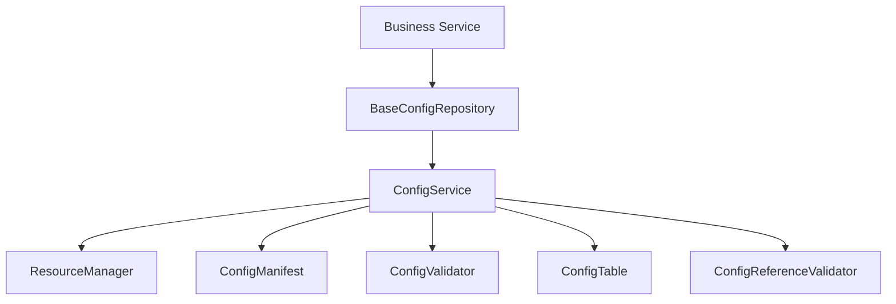
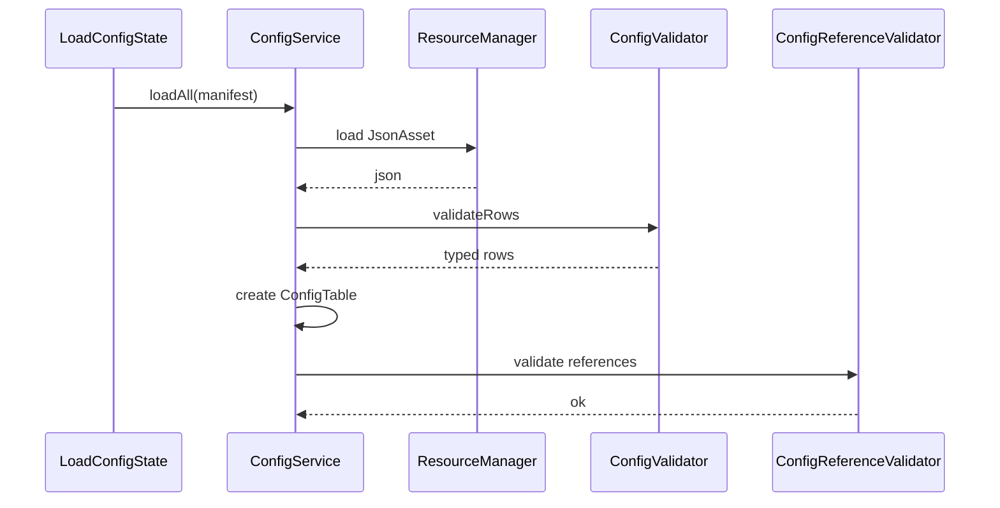

# 配置系统设计

## 1. 系统定位

配置系统负责统一加载、解析、校验和查询配置。配置错误必须在启动阶段或读取阶段暴露，不允许通过默认值掩盖。

## 2. 核心职责

- 根据 manifest 加载所有配置。
- 校验字段完整性和类型。
- 校验 ID 唯一。
- 校验跨表引用。
- 提供只读配置查询。

## 3. 核心类

| 类 | 路径 | 功能 |
| --- | --- | --- |
| `ConfigService` | `assets/scripts/core/config/ConfigService.ts` | 配置加载和查询入口 |
| `ConfigManifest` | `assets/scripts/core/config/ConfigManifest.ts` | 配置清单 |
| `ConfigValidator` | `assets/scripts/core/config/ConfigValidator.ts` | 单表校验器接口 |
| `ConfigTable` | `assets/scripts/core/config/ConfigTable.ts` | 只读配置表 |
| `ConfigReferenceValidator` | `assets/scripts/core/config/ConfigReferenceValidator.ts` | 跨表引用校验 |
| `BaseConfigRepository` | `assets/scripts/core/config/BaseConfigRepository.ts` | 业务配置仓库基类 |

## 4. 依赖关系



允许依赖：

- resource。
- error。
- logger。
- Cocos `JsonAsset`。

禁止依赖：

- 业务运行状态。
- UI。
- 存档。
- SDK。
- 默认配置兜底。

## 5. 加载与校验流程



## 6. 配置表建议

| 配置 | 用途 |
| --- | --- |
| `item_config` | 道具定义 |
| `level_config` | 关卡定义和关卡资源 |
| `reward_config` | 奖励定义 |
| `shop_config` | 商品定义 |
| `task_config` | 任务定义 |
| `guide_config` | 新手引导步骤 |
| `audio_config` | 音频 key 到资源路径映射 |
| `subgame_config` | 大厅入口、子游戏 bundle、入口 prefab、加载资源和结算模式 |

`subgame_config` 建议字段：

```ts
export interface SubGameConfig {
  readonly id: string
  readonly displayName: string
  readonly bundle: string
  readonly entryPrefab: string
  readonly loadingUiId: string
  readonly settlementMode: 'common' | 'custom'
  readonly requiredConfigs: readonly string[]
  readonly preloadResources: readonly string[]
  readonly hotUpdate: {
    readonly localManifestPath?: string
    readonly remoteVersionUrl?: string
    readonly remoteManifestUrl?: string
  }
}
```

## 7. Fail-Fast 规则

- 配置文件缺失直接抛错。
- JSON 格式错误直接抛错。
- 字段缺失直接抛错。
- 类型错误直接抛错。
- ID 重复直接抛错。
- 引用不存在直接抛错。
- `subgame_config.id` 重复直接抛错。
- `subgame_config` 引用不存在的 UI、资源、配置或子游戏模块时直接抛错。
- `settlementMode` 非法直接抛错。
- 开启全局子游戏独立热更新时，子游戏 manifest 路径和远端 URL 缺失直接抛错。
- `ConfigTable.get(id)` 不存在时直接抛错。
- 不允许自动补默认值。

## 8. 开发任务

1. 实现 `ConfigTable`。
2. 实现 `ConfigValidator` 基础工具。
3. 实现 `ConfigManifest`。
4. 实现 `ConfigService.loadAll`。
5. 实现跨表引用校验。
6. 为每张业务配置写类型和 validator。
7. 为业务模块写 ConfigRepository。
8. 为 `subgame_config` 增加类型、validator、repository 和跨表引用校验。

## 9. 验收标准

- 配置错误会阻止进入 Login / Hall。
- 业务模块不硬编码配置表名。
- 运行时配置对象不可被业务修改。
