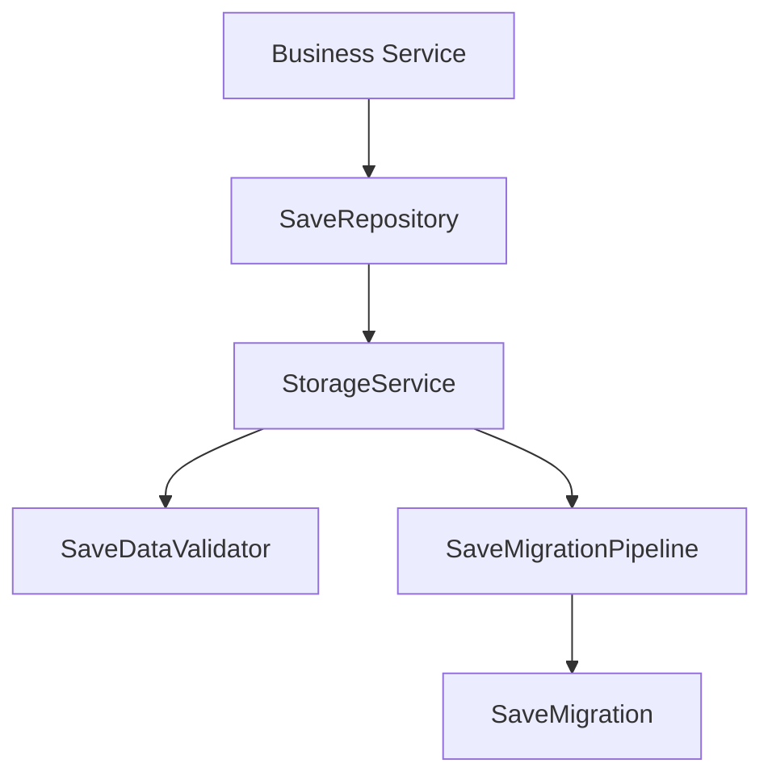
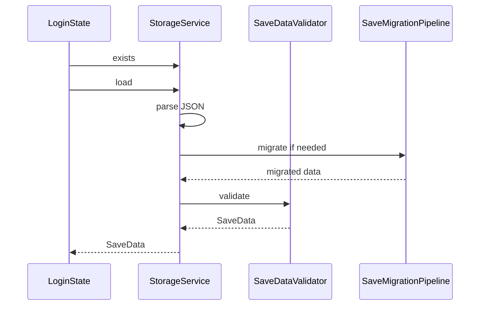

# 存档系统设计

## 1. 系统定位

存档系统负责统一管理本地存档读写、结构校验和版本迁移。业务模块不能直接访问 `sys.localStorage`。

## 2. 核心职责

- 读取存档。
- 写入存档。
- 校验存档结构。
- 处理版本迁移。
- 提供明确的新用户创建流程。
- 为模块提供局部存档 Repository。

## 3. 核心类

| 类 | 路径 | 功能 |
| --- | --- | --- |
| `StorageService` | `assets/scripts/core/storage/StorageService.ts` | 存档读写入口 |
| `SaveData` | `assets/scripts/core/storage/SaveData.ts` | 存档根结构 |
| `SaveDataValidator` | `assets/scripts/core/storage/SaveDataValidator.ts` | 存档结构校验 |
| `SaveMigration` | `assets/scripts/core/storage/SaveMigration.ts` | 单步版本迁移 |
| `SaveMigrationPipeline` | `assets/scripts/core/storage/SaveMigrationPipeline.ts` | 迁移链执行 |
| `SaveRepository` | `assets/scripts/core/storage/SaveRepository.ts` | 模块存档片段读写接口 |

## 4. 依赖关系



允许依赖：

- error。
- logger。
- Cocos `sys.localStorage`。

禁止依赖：

- UI。
- SDK。
- 资源系统。
- 其他模块内部 Model。

## 5. 读取流程



## 6. 新用户流程

新用户可以创建初始存档，但必须由明确流程触发：

```text
LoginState -> detect no save -> create initial SaveData -> StorageService.createNew
```

禁止：

- 读取失败后自动创建新存档。
- 存档损坏后静默重置。
- 版本不匹配时跳过迁移。

## 7. Fail-Fast 规则

- JSON 解析失败直接抛错。
- 存档字段缺失直接抛错。
- 存档类型错误直接抛错。
- 版本无迁移路径直接抛错。
- 保存前校验失败直接抛错。

## 8. 开发任务

1. 定义 `SaveData` 根结构。
2. 实现 `SaveDataValidator`。
3. 实现 `SaveMigration` 和迁移管线。
4. 实现 `StorageService`。
5. 为各模块创建 `SaveRepository`。
6. 在 LoginState 接入读取或新用户创建。

## 9. 验收标准

- 存档损坏不会被静默重置。
- 模块只能读写自己的存档片段。
- 存档迁移链可单测。
