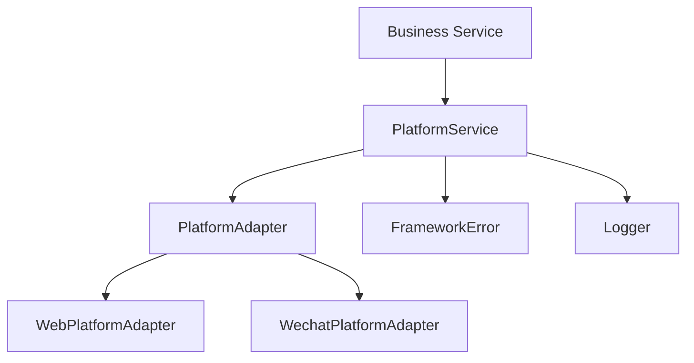
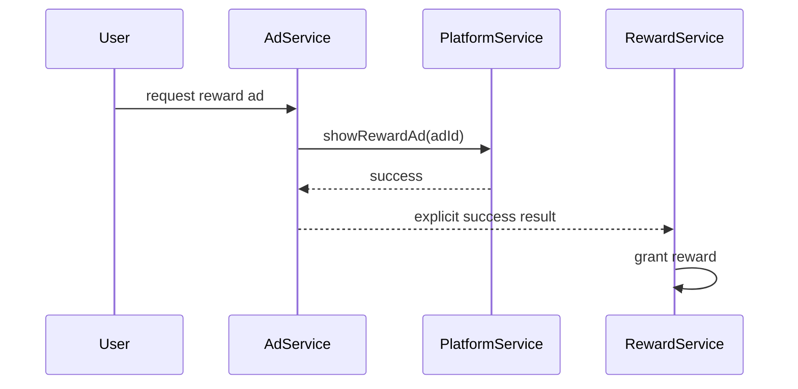

# 平台适配系统设计

## 1. 系统定位

平台适配系统负责隔离微信、Android、iOS、Web 等平台 SDK。业务模块只能依赖 `PlatformService` 或 `PlatformAdapter` 接口，不能直接调用平台 SDK。

## 2. 核心职责

- 定义平台能力接口。
- 注入当前平台 adapter。
- 包装平台 SDK 错误。
- 给业务提供登录、支付、分享、广告、震动等能力。

## 3. 核心类

| 类 | 路径 | 功能 |
| --- | --- | --- |
| `PlatformAdapter` | `assets/scripts/platform/PlatformAdapter.ts` | 平台能力接口 |
| `PlatformService` | `assets/scripts/platform/PlatformService.ts` | 平台能力统一入口 |
| `WebPlatformAdapter` | `assets/scripts/platform/WebPlatformAdapter.ts` | Web 平台实现 |
| `WechatPlatformAdapter` | `assets/scripts/platform/WechatPlatformAdapter.ts` | 微信小游戏实现 |
| `PlatformTypes` | `assets/scripts/platform/PlatformTypes.ts` | 登录、支付、广告等类型 |

## 4. 依赖关系

允许依赖：

- error。
- logger。
- 平台 SDK 只允许出现在具体 Adapter 实现中。

禁止依赖：

- UI。
- 业务奖励发放。
- 业务 Model。
- 默认成功兜底。

## 5. 广告和奖励边界

正确流程：

规则：

- `PlatformService` 只返回广告观看结果。
- `AdService` 只处理广告业务入口。
- `RewardService` 才负责发奖励。
- 广告失败不能发奖励。

## 6. Fail-Fast 规则

- 未设置 adapter 直接抛错。
- SDK 调用失败必须带平台名、接口名、参数。
- 不支持的平台能力必须明确抛错。
- 不允许自动降级到 WebAdapter。
- 不允许模拟支付成功或广告成功。

## 7. 开发任务

1. 定义 `PlatformTypes`。
2. 定义 `PlatformAdapter`。
3. 实现 `PlatformService`。
4. 实现 `WebPlatformAdapter`。
5. 需要接微信时实现 `WechatPlatformAdapter`。
6. 在 `AppBootstrap` 或平台初始化流程中注入 adapter。

## 8. 验收标准

- 业务代码没有直接平台 SDK 调用。
- 平台失败能暴露到业务层。
- 广告和奖励职责分离。
