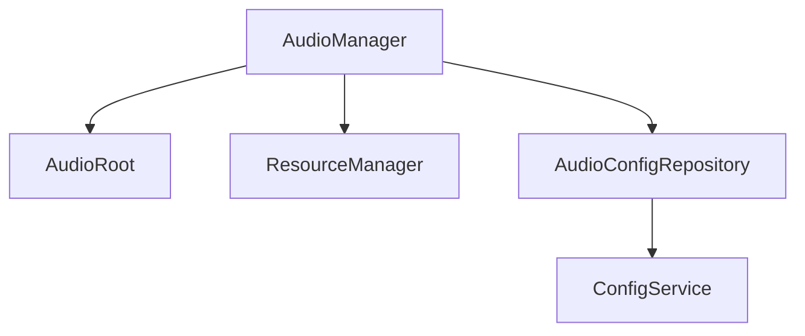
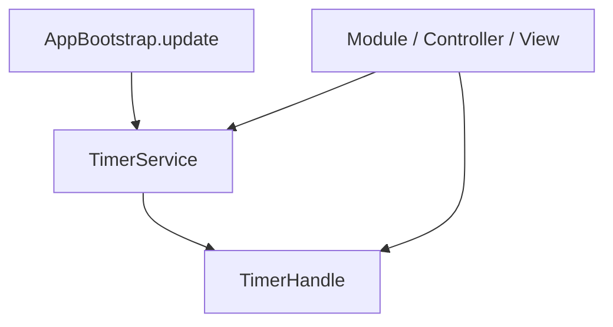

# 音频与计时器系统设计

## 1. 系统定位

音频系统负责统一播放 BGM / SFX，计时器系统负责统一管理延迟、循环和倒计时任务。二者都是基础能力，不承载业务规则。

---

## 2. 音频系统

### 2.1 核心职责

- 根据 audio_config 使用 audio key 播放音频。
- 通过 ResourceManager 加载 AudioClip。
- 管理 BGM、SFX、音量、静音。
- 缺音频配置或资源时 fail-fast。

### 2.2 核心类

| 类 | 路径 | 功能 |
| --- | --- | --- |
| `AudioManager` | `assets/scripts/core/audio/AudioManager.ts` | 音频播放入口 |
| `AudioRoot` | `assets/scripts/core/audio/AudioRoot.ts` | Cocos 音源节点绑定 |
| `AudioConfigRepository` | `assets/scripts/core/audio/AudioConfigRepository.ts` | 音频配置查询 |

### 2.3 依赖关系

允许依赖：

- resource。
- config。
- error。
- logger。
- Cocos `AudioSource`、`AudioClip`。

禁止依赖：

- 业务决策。
- 默认音频兜底。
- 静默播放失败。

### 2.4 Fail-Fast 规则

- audioKey 不存在直接抛错。
- 音频资源加载失败直接抛错。
- AudioSource 未绑定直接抛错。
- volume 配置非法直接抛错。

---

## 3. 计时器系统

### 3.1 核心职责

- 创建 delay 任务。
- 创建 interval 任务。
- 返回可释放句柄。
- 支持按 owner 批量清理。
- callback 异常必须暴露。

### 3.2 核心类

| 类 | 路径 | 功能 |
| --- | --- | --- |
| `TimerService` | `assets/scripts/core/timer/TimerService.ts` | 计时器统一入口 |
| `TimerHandle` | `assets/scripts/core/timer/TimerHandle.ts` | 计时器句柄 |

### 3.3 依赖关系

允许依赖：

- error。
- logger。
- app/Disposable。

禁止依赖：

- 业务倒计时规则。
- UI 状态修改细节。
- callback 异常吞掉。

### 3.4 Fail-Fast 规则

- seconds 小于等于 0 直接抛错。
- owner 为空直接抛错。
- callback 抛错时暴露错误。
- owner 清理后任务不可继续执行。

## 4. 开发任务

1. 实现 `AudioRoot`。
2. 实现 `AudioConfigRepository`。
3. 实现 `AudioManager`。
4. 实现 `TimerHandle`。
5. 实现 `TimerService`。
6. 在 AppBootstrap.update 中驱动 TimerService。

## 5. 验收标准

- 音频全部由配置 key 驱动。
- 音频缺失不静默忽略。
- UI 销毁或模块释放后 timer 不再回调。
