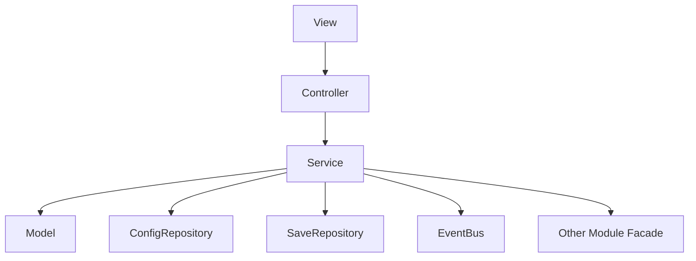
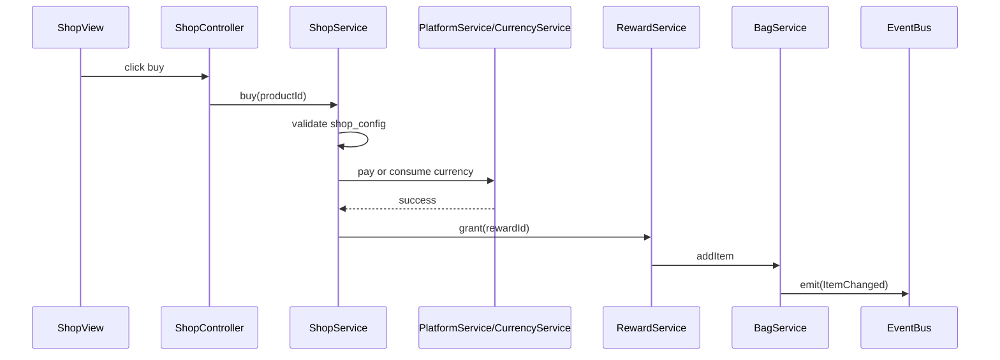
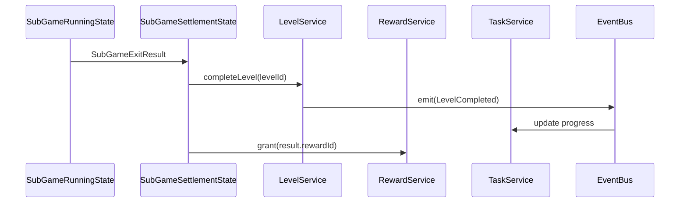

# 业务系统设计

## 1. 系统定位

业务系统位于 `assets/scripts/modules`，每个系统按模块自治。业务模块可以使用 core 能力，但不能污染 core，也不能直接修改其他模块内部状态。

## 2. 通用模块结构

```text
modules/<moduleName>/
├─ <ModuleName>Module.ts
├─ <ModuleName>Model.ts
├─ <ModuleName>Service.ts
├─ <ModuleName>Controller.ts
├─ <ModuleName>View.ts
├─ <ModuleName>Types.ts
├─ <ModuleName>Events.ts
├─ <ModuleName>ConfigRepository.ts
└─ index.ts
```

## 3. 通用依赖关系



## 4. 推荐业务系统

### 4.1 大厅系统 `HallService`

职责：

- 根据 `subgame_config` 提供大厅入口列表。
- 展示入口所需的业务数据由 Controller / Presenter 组装。
- 校验用户是否满足进入子游戏条件。
- 生成进入子游戏的参数。

禁止：

- 不直接加载子游戏资源。
- 不直接实例化子游戏 prefab。
- 不直接修改子游戏内部 Model。

### 4.2 子游戏生命周期系统 `SubGameLifecycleService`

职责：

- 根据 `gameId` 查找子游戏模块。
- 编排子游戏 preload、enter、exit、dispose。
- 管理本次运行的 `runId` 和资源 owner。
- 将子游戏退出结果交给结算流程。

禁止：

- 不写具体子游戏业务规则。
- 不直接发最终奖励。
- 不吞掉子游戏加载或退出失败。

### 4.3 背包系统 `BagService`

职责：

- 管理道具数量。
- 校验 item_config。
- 提供增加、消耗、查询接口。
- 派发道具变化事件。

禁止：

- 不处理购买流程。
- 不处理奖励来源判断。
- 不直接操作 UI。

### 4.4 货币系统 `CurrencyService`

职责：

- 管理金币、钻石等货币。
- 提供增加、扣除、查询。
- 货币不足时返回明确失败或抛业务错误。

禁止：

- 不直接发奖励配置。
- 不处理商城支付流程。

### 4.5 关卡系统 `LevelService`

职责：

- 管理关卡解锁、开始、完成状态。
- 读取 level_config。
- 生成进入子游戏或关卡玩法的参数。

禁止：

- 不加载关卡资源。
- 不打开战斗 UI。
- 不发奖励。

### 4.6 奖励系统 `RewardService`

职责：

- 根据 reward_config 计算奖励。
- 调用背包、货币等模块公开 API 发放奖励。
- 记录奖励来源。

禁止：

- 不打开结算 UI。
- 不绕过其他模块 Service 直接改 Model。

### 4.7 广告系统 `AdService`

职责：

- 管理广告位。
- 调用 PlatformService 展示广告。
- 返回广告观看结果。

禁止：

- 不发奖励。
- 不在广告失败后默认成功。

### 4.8 任务系统 `TaskService`

职责：

- 根据 task_config 管理任务状态和进度。
- 监听游戏事件更新任务。
- 领取奖励时调用 RewardService。

禁止：

- 不直接发背包道具。
- 不用 EventBus 承载完整领奖流程。

### 4.9 商城系统 `ShopService`

职责：

- 根据 shop_config 处理商品购买。
- 校验价格、限购、前置条件。
- 调用 PlatformService 支付或 CurrencyService 扣费。
- 支付成功后调用 RewardService 发货。

禁止：

- 不直接操作商城 UI。
- 不在支付失败后发货。

### 4.10 红点系统 `RedDotService`

职责：

- 注册红点 key。
- 监听数据变化事件。
- 计算红点状态。
- 通知 UI 刷新。

禁止：

- 不修改业务数据。
- 不主动拉取 UI 节点。

### 4.11 新手引导系统 `GuideService`

职责：

- 管理引导步骤。
- 根据 guide_config 判断目标和条件。
- 记录引导存档。
- 通知 Guide UI 显示遮罩。

禁止：

- 不直接查找业务 UI 节点。
- 不绕过 Controller 强行推进业务。

## 5. 系统协作示例：商城购买



## 6. 系统协作示例：子游戏完成



## 7. Fail-Fast 规则

- 道具 id 不存在直接抛错。
- rewardId 不存在直接抛错。
- levelId 不存在直接抛错。
- 商品配置非法直接抛错。
- 子游戏 id 不存在直接抛错。
- 子游戏模块未注册直接抛错。
- 支付失败必须暴露。
- 广告失败不能发奖励。
- 任务配置引用不存在直接抛错。

## 8. 验收标准

- 每个业务系统有独立 Model / Service。
- UI 不写业务规则。
- 业务之间通过 Facade 或 EventBus 协作。
- 核心业务逻辑可单测。
