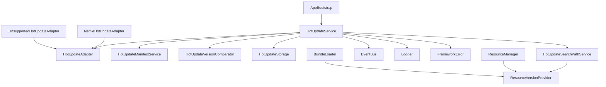
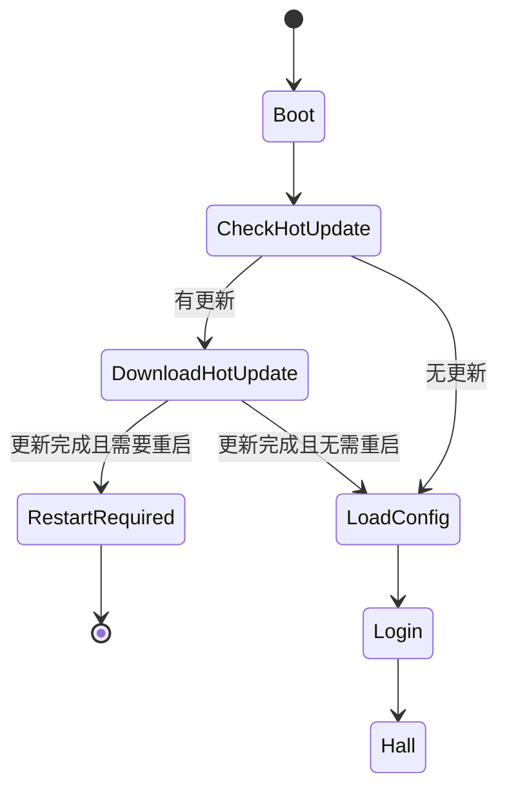
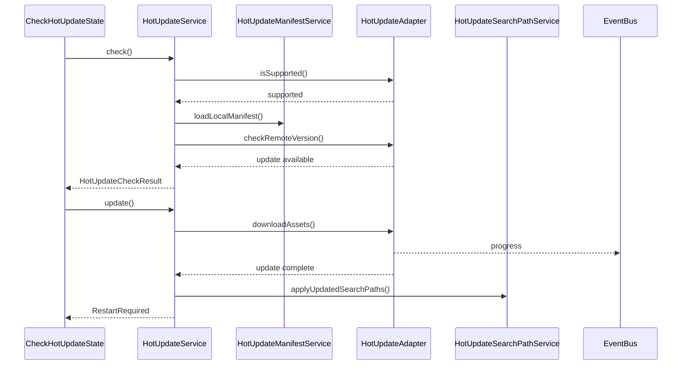

# 热更新系统设计

## 1. 系统定位

热更新系统负责在应用启动早期检查远端资源版本、下载差异资源、校验资源完整性、更新本地搜索路径，并在必要时提示重启。它属于基础设施系统，不承载业务逻辑，也不直接决定进入哪个业务界面。

Cocos Creator 3.8.8 中，常规热更新主要面向原生平台。Web、小游戏等平台应走各自平台能力或明确声明不支持，禁止伪装成热更新成功。

## 2. 核心职责

- 读取本地 manifest。
- 请求远端 version manifest / project manifest。
- 比较本地版本与远端版本。
- 下载需要更新的资源。
- 校验资源完整性。
- 更新原生搜索路径。
- 持久化热更新状态。
- 向 UI 或启动流程暴露检查、下载、失败、需要重启等状态。

## 3. 不负责的事情

- 不直接加载业务资源。
- 不直接打开业务 UI。
- 不发奖励、不改存档业务数据。
- 不吞下载失败。
- 不在不支持的平台假装成功。
- 不替 ResourceManager 做资源引用计数。

---

## 4. 推荐目录结构

```text
assets/scripts/core/hotupdate/
├─ HotUpdateService.ts
├─ HotUpdateAdapter.ts
├─ NativeHotUpdateAdapter.ts
├─ UnsupportedHotUpdateAdapter.ts
├─ HotUpdateConfig.ts
├─ HotUpdateState.ts
├─ HotUpdateEvents.ts
├─ HotUpdateResult.ts
├─ HotUpdateManifestService.ts
├─ HotUpdateVersionComparator.ts
├─ HotUpdateStorage.ts
├─ HotUpdateSearchPathService.ts
└─ HotUpdateError.ts

assets/resources/hotupdate/
├─ project.manifest
└─ version.manifest

tools/hotupdate/
├─ generate-manifest.js
├─ hotupdate.config.json
└─ README.md
```

说明：

- `assets/resources/hotupdate` 存放随包发布的初始 manifest。
- `tools/hotupdate` 存放构建期 manifest 生成工具。
- `tools/hotupdate/hotupdate.config.json` 统一声明全量包、大厅壳包和子游戏 bundle 的生成目标。
- 原生下载缓存目录不放在 `assets` 中，由 `HotUpdateStorage` / native adapter 管理。

---

## 5. 核心类

| 类 | 路径 | 功能 |
| --- | --- | --- |
| `HotUpdateService` | `assets/scripts/core/hotupdate/HotUpdateService.ts` | 热更新流程编排入口 |
| `HotUpdateAdapter` | `assets/scripts/core/hotupdate/HotUpdateAdapter.ts` | 平台热更新能力接口 |
| `NativeHotUpdateAdapter` | `assets/scripts/core/hotupdate/NativeHotUpdateAdapter.ts` | 原生平台热更新实现，封装 `jsb.AssetsManager` |
| `UnsupportedHotUpdateAdapter` | `assets/scripts/core/hotupdate/UnsupportedHotUpdateAdapter.ts` | 不支持平台的显式失败实现 |
| `HotUpdateConfig` | `assets/scripts/core/hotupdate/HotUpdateConfig.ts` | 热更新配置 |
| `HotUpdateState` | `assets/scripts/core/hotupdate/HotUpdateState.ts` | 热更新状态枚举 |
| `HotUpdateEvents` | `assets/scripts/core/hotupdate/HotUpdateEvents.ts` | 热更新事件定义 |
| `HotUpdateResult` | `assets/scripts/core/hotupdate/HotUpdateResult.ts` | 检查、下载、完成结果类型 |
| `HotUpdateManifestService` | `assets/scripts/core/hotupdate/HotUpdateManifestService.ts` | manifest 加载、解析、校验 |
| `HotUpdateVersionComparator` | `assets/scripts/core/hotupdate/HotUpdateVersionComparator.ts` | 版本比较策略 |
| `HotUpdateStorage` | `assets/scripts/core/hotupdate/HotUpdateStorage.ts` | 热更新状态和搜索路径持久化 |
| `HotUpdateSearchPathService` | `assets/scripts/core/hotupdate/HotUpdateSearchPathService.ts` | 当前有效资源搜索路径管理 |
| `HotUpdateError` | `assets/scripts/core/hotupdate/HotUpdateError.ts` | 热更新错误码和错误上下文 |

---

## 6. 依赖关系



允许依赖：

- error。
- logger。
- event。
- resource 的搜索路径接口。
- platform 或 native adapter。
- Cocos 原生环境中的 `jsb.AssetsManager`。

禁止依赖：

- 业务模块。
- UI 具体实现。
- 存档业务数据。
- 奖励、商城、任务等业务系统。

---

## 7. 启动接入位置

推荐在 `LoadConfigState` 之前增加热更新检查：



对应新增状态：

| 状态 | 职责 |
| --- | --- |
| `CheckHotUpdateState` | 检查平台是否支持热更新、读取本地 manifest、查询远端版本 |
| `DownloadHotUpdateState` | 下载更新资源、监听进度、处理失败 |
| `RestartRequiredState` | 通知 UI 显示重启提示，不继续进入游戏 |

如果项目不希望 FSM 增加热更新状态，也可以在 `BootState` 内部调用 `HotUpdateService.checkAndUpdate()`，但推荐使用独立状态，这样流程更清晰，也更容易测试。

---

## 8. 热更新流程



---

## 9. 状态定义

```ts
export enum HotUpdateState {
  Idle = 'Idle',
  Checking = 'Checking',
  AlreadyLatest = 'AlreadyLatest',
  UpdateAvailable = 'UpdateAvailable',
  Downloading = 'Downloading',
  Verifying = 'Verifying',
  Updated = 'Updated',
  RestartRequired = 'RestartRequired',
  Failed = 'Failed',
  Unsupported = 'Unsupported',
}
```

状态规则：

- `Idle` 只能进入 `Checking`。
- `Checking` 可以进入 `AlreadyLatest`、`UpdateAvailable`、`Unsupported`、`Failed`。
- `UpdateAvailable` 只能进入 `Downloading`。
- `Downloading` 可以进入 `Verifying` 或 `Failed`。
- `Verifying` 可以进入 `Updated` 或 `Failed`。
- `Updated` 如果搜索路径变化，必须进入 `RestartRequired`。

---

## 10. 关键接口建议

### 10.1 `HotUpdateService`

```ts
export class HotUpdateService {
  init(config: HotUpdateConfig, adapter: HotUpdateAdapter): void
  check(): Promise<HotUpdateCheckResult>
  update(): Promise<HotUpdateApplyResult>
  getState(): HotUpdateState
  getCurrentVersion(): string
  dispose(): void
}
```

### 10.2 `HotUpdateAdapter`

```ts
export interface HotUpdateAdapter {
  readonly platformName: string
  isSupported(): boolean
  check(config: HotUpdateConfig): Promise<HotUpdateCheckResult>
  update(config: HotUpdateConfig): Promise<HotUpdateApplyResult>
  cancel(): void
}
```

### 10.3 `HotUpdateConfig`

```ts
export interface HotUpdateConfig {
  readonly enabled: boolean
  readonly localManifestPath: string
  readonly remoteVersionUrl: string
  readonly remoteManifestUrl: string
  readonly storagePath: string
  readonly retryCount: number
  readonly timeoutMs: number
  readonly requireRestartAfterUpdated: boolean
}
```

### 10.4 `HotUpdateSearchPathService`

```ts
export class HotUpdateSearchPathService {
  getCurrentSearchPaths(): readonly string[]
  applySearchPaths(paths: string[]): void
  persistSearchPaths(paths: string[]): void
  restorePersistedSearchPaths(): void
}
```

---

## 11. ResourceManager 适配要求

热更新接入后，资源系统必须适配以下能力：

1. `ResourceManager` 初始化时先读取 `HotUpdateSearchPathService` 的当前搜索路径。
2. `BundleLoader` 加载 bundle 时优先尊重热更新后的搜索路径。
3. `ResourceKey` 增加资源版本字段或搜索路径来源字段，避免新旧资源缓存混淆。
4. 热更新完成后，`ResourceManager` 必须清理旧版本缓存，避免继续持有旧 Asset。
5. 热更新需要重启时，业务流程不能继续进入 `LoadConfigState`。
6. `ResourceManager` 不负责下载更新，只负责按当前有效路径加载资源。
7. 已加载资源不能被热更新系统直接强行替换，必须通过重启或明确 reload 流程完成。

推荐新增接口：

```ts
export interface ResourceVersionProvider {
  getResourceVersion(): string
  getSearchPaths(): readonly string[]
}
```

`HotUpdateSearchPathService` 实现该接口，`ResourceManager` 只依赖接口，不依赖完整 `HotUpdateService`。

---

## 12. 平台策略

| 平台 | 策略 |
| --- | --- |
| Native Android / iOS | 使用 `NativeHotUpdateAdapter` 封装 `jsb.AssetsManager` |
| Web | 默认不支持此热更新系统，使用浏览器缓存或发版策略，adapter 返回 Unsupported |
| 微信小游戏 | 走小游戏平台更新能力或包体资源策略，不复用 native manifest 方案 |
| 编辑器 | 默认不执行热更新，adapter 返回 Unsupported 或 Disabled |

规则：

- `Unsupported` 不是成功，也不是失败兜底，它是明确的平台能力结果。
- 如果配置 `enabled=true` 且当前平台不支持，启动流程必须按产品策略处理：阻断、提示或跳过。跳过必须是显式配置，不是 fallback。

---

## 13. 热更新 UI 边界

热更新 UI 可以提供：

- 检查更新提示。
- 下载进度条。
- 失败重试按钮。
- 重启提示。

但 UI 禁止：

- 直接调用 `jsb.AssetsManager`。
- 直接修改搜索路径。
- 直接决定进入 Hall 或子游戏。
- 吞掉热更新失败。

推荐结构：

```text
modules/hotupdate-ui/
├─ HotUpdateView.ts
├─ HotUpdateController.ts
└─ HotUpdateTypes.ts
```

---

## 14. 子游戏独立热更新

大厅 + 多子游戏模式下，全局热更新和子游戏热更新分离：

- 全局热更新在启动流程执行，处理框架和公共资源。
- `subGameIndependentUpdateEnabled=true` 时，全局热更新只处理大厅、框架和公共模块；子游戏热更新在进入子游戏前执行，只处理当前 `gameId` 对应的 bundle。
- `subGameIndependentUpdateEnabled=false` 时，全局热更新处理整个项目，包含所有子游戏 bundle；进入子游戏时不检查、不下载、不访问该子游戏远端 manifest。
- 子游戏独立热更新开启时，每个子游戏必须配置 `localManifestPath`、`remoteVersionUrl`、`remoteManifestUrl`。
- 更新结果必须写入 bundle 级版本，供 `ResourceManager` 和 `BundleLoader` 隔离缓存。

推荐流程：

```text
SubGameLoadingState
-> SubGameConfigRepository.get(gameId)
-> SubGameHotUpdateService.checkAndApply(config)
-> HotUpdateSearchPathService.persistBundleVersion(bundle, newVersion)
-> ResourceManager.loadPrefab(bundle, entryPrefab)
```

Fail-Fast：

- 开关开启但平台不支持热更新，直接报错。
- 开关开启但 manifest 配置缺失，直接报错。
- 更新要求重启时，不能继续加载子游戏 bundle。

如果项目希望热更新 UI 保持基础能力，也可以放在 `core/ui` 的 loading/update 面板中，但仍然只能通过 `HotUpdateService` 获取状态。

---

## 15. Manifest 设计

manifest 至少需要描述：

- 应用资源版本。
- package url。
- remote version manifest url。
- remote project manifest url。
- asset 列表。
- 每个 asset 的 md5 或校验值。
- 每个 asset 的 size。

构建要求：

- 每次正式出包必须通过 `tools/hotupdate/generate-manifest.js` 生成随包 `project.manifest` 和 `version.manifest`。
- 每次热更新发布必须通过同一脚本生成远端 manifest。
- 远端资源与 manifest 必须同版本一致。
- manifest 生成脚本不能使用 mock 数据。

### 15.1 自动生成工具

项目提供 `npm run hotupdate:manifest` 自动生成 manifest，默认读取 `tools/hotupdate/hotupdate.config.json`：

```bash
npm run hotupdate:manifest
```

只生成指定目标：

```bash
npm run hotupdate:manifest -- --target full
npm run hotupdate:manifest -- --target shell,subgame-exampleGame
```

临时覆盖版本号：

```bash
npm run hotupdate:manifest -- --target subgame-exampleGame --version 1.0.1
```

生成器职责：

- 递归扫描目标 `sourceDir`。
- 根据 `include` / `exclude` 过滤资源文件。
- 为每个资源计算 `md5` 和 `size`。
- 输出 `project.manifest` 和 `version.manifest`。
- 默认排除 manifest 文件自身、Cocos `.meta` 和常见系统元文件，避免非业务资源进入清单。
- 缺配置、缺目录、URL 非法、资源为空时直接失败。

当前默认目标：

| 目标 | 用途 | 输出目录 |
| --- | --- | --- |
| `full` | 全量更新，包含大厅、公共模块和所有子游戏 | `assets/resources/hotupdate` |
| `shell` | 大厅壳更新，只包含大厅、框架和公共模块 | `assets/resources/hotupdate/shell` |
| `subgame-exampleGame` | `exampleGame` 子游戏 bundle 独立更新 | `assets/resources/subgames/exampleGame` |

配置字段：

| 字段 | 要求 |
| --- | --- |
| `name` | 目标唯一名称，不允许重复。 |
| `version` | 写入 manifest 的版本号。 |
| `sourceDir` | Cocos 构建产物目录，必须存在且至少匹配一个文件。 |
| `outputDir` | manifest 输出目录，脚本会自动创建。 |
| `packageUrl` | 远端资源根地址，必须是 HTTP/HTTPS 且以 `/` 结尾。 |
| `remoteVersionUrl` | 远端 `version.manifest` URL。 |
| `remoteManifestUrl` | 远端 `project.manifest` URL。 |
| `searchPaths` | 写入 manifest 的搜索路径数组。 |
| `include` | 可选，仅包含匹配文件，支持 `*`、`**`、`?`。 |
| `exclude` | 可选，排除匹配文件，支持 `*`、`**`、`?`。 |

新增子游戏时，需要新增一个 `subgame-<gameId>` 目标，并保证：

- `outputDir` 与 `subgame_config.hotUpdate.localManifestPath` 对齐。
- `packageUrl`、`remoteVersionUrl`、`remoteManifestUrl` 与 CDN 实际发布路径一致。
- 大厅壳 `shell.exclude` 已排除该子游戏 bundle，否则独立更新开启时大厅壳会错误包含子游戏资源。

---

## 16. Fail-Fast 规则

- 本地 manifest 缺失直接抛错。
- manifest 字段缺失直接抛错。
- manifest URL 为空直接抛错。
- 远端 manifest 下载失败必须暴露。
- 版本比较失败必须暴露。
- 资源下载失败必须暴露。
- 资源校验失败必须暴露。
- 搜索路径应用失败必须暴露。
- 不支持平台不能假装热更新成功。
- 热更新完成但要求重启时，禁止继续进入游戏主流程。

---

## 17. 开发任务

1. 新增 `assets/scripts/core/hotupdate` 目录。
2. 定义 `HotUpdateState`、`HotUpdateResult`、`HotUpdateEvents`。
3. 定义 `HotUpdateConfig`。
4. 实现 `HotUpdateVersionComparator`。
5. 实现 `HotUpdateManifestService`。
6. 实现 `HotUpdateStorage`。
7. 实现 `HotUpdateSearchPathService`。
8. 定义 `HotUpdateAdapter`。
9. 实现 `UnsupportedHotUpdateAdapter`。
10. 实现 `NativeHotUpdateAdapter`。
11. 实现 `HotUpdateService`。
12. 在 `AppContext` 注册 `HotUpdateService` 和 `ResourceVersionProvider`。
13. 新增 `CheckHotUpdateState`、`DownloadHotUpdateState`、`RestartRequiredState`。
14. 修改 `GameState` 和状态转移表。
15. 修改 `ResourceManager` 和 `BundleLoader`，接入搜索路径与资源版本。
16. 增加 manifest 生成工具文档或脚本。

---

## 18. 验收标准

- 原生平台能检查远端版本。
- 有更新时能下载并汇报进度。
- 更新完成后能应用搜索路径。
- 需要重启时不会继续进入游戏。
- 无更新时正常进入配置加载流程。
- 不支持平台有明确结果，不会伪装成功。
- ResourceManager 不直接参与下载，但能按更新后的资源路径加载。
- 热更新失败能显示错误并允许显式重试。
- Manifest 可通过 `npm run hotupdate:manifest` 自动生成，不需要手工维护资源 `md5` 和 `size`。

