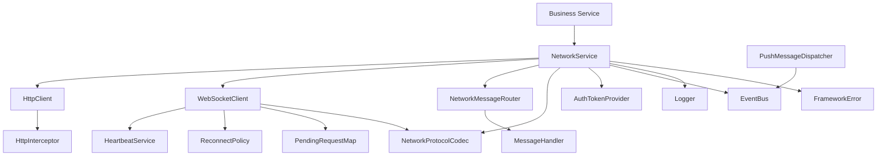
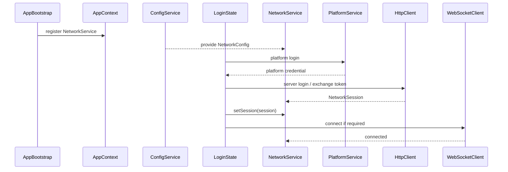
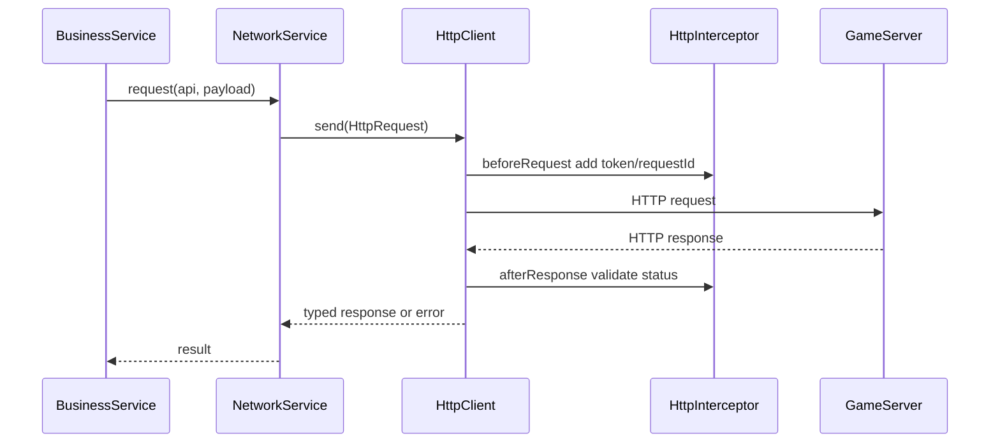
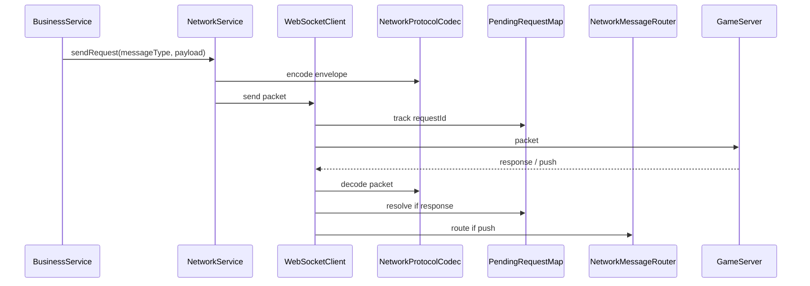
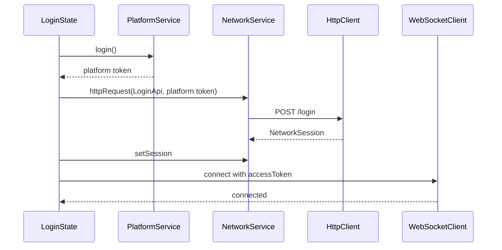
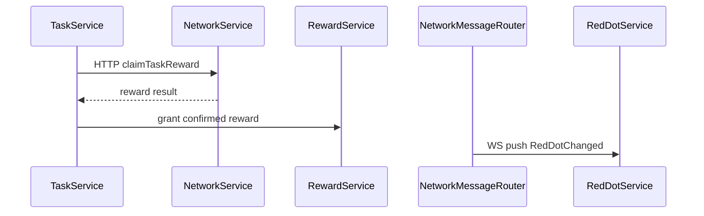

# 游戏网络层系统设计（HTTP + WebSocket）

## 1. 系统定位

网络层负责统一管理游戏客户端与服务端之间的通信能力，采用 HTTP + WebSocket 混合架构：

- HTTP：适合登录换取服务器 token、短事务请求、查询类接口、一次性提交。
- WebSocket：适合长连接、服务端推送、实时状态同步、战斗/房间/聊天等低延迟消息。

网络层属于基础设施系统，不承载业务规则，不直接修改业务 Model，不直接操作 UI，不直接读写存档。

---

## 2. 核心目标

- 统一 HTTP 请求入口。
- 统一 WebSocket 长连接入口。
- 统一协议编码和解码。
- 统一错误、超时、重试、鉴权、心跳、重连策略。
- 支持 requestId / sequenceId 做请求响应匹配。
- 支持服务端推送消息路由到业务 Service。
- 支持网络状态事件通知 UI 和业务模块。
- 所有网络失败必须显式暴露，禁止静默失败和 fallback 伪成功。

---

## 3. 不负责的事情

- 不直接修改玩家、背包、关卡、任务等业务 Model。
- 不直接打开弹窗或 Toast。
- 不直接读写本地存档。
- 不直接调用平台 SDK。
- 不把服务器错误转换成成功结果。
- 不在 WebSocket 失败后悄悄改用 HTTP 完成业务流程，除非接口协议明确支持并由业务 Service 显式调用。

---

## 4. 推荐目录结构

```text
assets/scripts/core/network/
├─ NetworkService.ts
├─ NetworkConfig.ts
├─ NetworkState.ts
├─ NetworkEvents.ts
├─ NetworkError.ts
├─ NetworkTypes.ts
├─ http/
│  ├─ HttpClient.ts
│  ├─ HttpRequest.ts
│  ├─ HttpResponse.ts
│  ├─ HttpInterceptor.ts
│  └─ HttpErrorMapper.ts
├─ websocket/
│  ├─ WebSocketClient.ts
│  ├─ WebSocketState.ts
│  ├─ WebSocketPacket.ts
│  ├─ HeartbeatService.ts
│  ├─ ReconnectPolicy.ts
│  └─ PendingRequestMap.ts
├─ protocol/
│  ├─ NetworkProtocolCodec.ts
│  ├─ JsonProtocolCodec.ts
│  ├─ BinaryProtocolCodec.ts
│  ├─ MessageEnvelope.ts
│  └─ MessageTypeRegistry.ts
├─ router/
│  ├─ NetworkMessageRouter.ts
│  ├─ MessageHandler.ts
│  └─ PushMessageDispatcher.ts
└─ auth/
   ├─ AuthTokenProvider.ts
   ├─ NetworkSession.ts
   └─ ServerTimeSyncService.ts
```

说明：

- `http` 只处理 HTTP 请求生命周期。
- `websocket` 只处理长连接生命周期。
- `protocol` 只处理编码、解码、消息信封。
- `router` 只处理消息分发，不写业务规则。
- `auth` 只提供网络鉴权所需 token/session 接口，不直接读写存档。

---

## 5. 核心类

| 类 | 路径 | 功能 |
| --- | --- | --- |
| `NetworkService` | `assets/scripts/core/network/NetworkService.ts` | 网络统一门面，组合 HTTP 和 WebSocket |
| `NetworkConfig` | `assets/scripts/core/network/NetworkConfig.ts` | 网络环境、域名、超时、心跳、重连配置 |
| `NetworkState` | `assets/scripts/core/network/NetworkState.ts` | 网络状态枚举 |
| `NetworkEvents` | `assets/scripts/core/network/NetworkEvents.ts` | 网络状态、重连、推送事件定义 |
| `NetworkError` | `assets/scripts/core/network/NetworkError.ts` | 网络错误码和错误上下文 |
| `HttpClient` | `assets/scripts/core/network/http/HttpClient.ts` | HTTP 请求入口 |
| `HttpInterceptor` | `assets/scripts/core/network/http/HttpInterceptor.ts` | 请求/响应拦截器 |
| `WebSocketClient` | `assets/scripts/core/network/websocket/WebSocketClient.ts` | WebSocket 连接、发送、关闭、接收 |
| `HeartbeatService` | `assets/scripts/core/network/websocket/HeartbeatService.ts` | 心跳发送和超时检测 |
| `ReconnectPolicy` | `assets/scripts/core/network/websocket/ReconnectPolicy.ts` | 有界重连策略 |
| `PendingRequestMap` | `assets/scripts/core/network/websocket/PendingRequestMap.ts` | WebSocket 请求响应匹配 |
| `NetworkProtocolCodec` | `assets/scripts/core/network/protocol/NetworkProtocolCodec.ts` | 协议编码/解码接口 |
| `MessageEnvelope` | `assets/scripts/core/network/protocol/MessageEnvelope.ts` | 统一消息信封 |
| `MessageTypeRegistry` | `assets/scripts/core/network/protocol/MessageTypeRegistry.ts` | 消息类型注册表 |
| `NetworkMessageRouter` | `assets/scripts/core/network/router/NetworkMessageRouter.ts` | 入站消息路由 |
| `PushMessageDispatcher` | `assets/scripts/core/network/router/PushMessageDispatcher.ts` | 服务端推送分发 |
| `AuthTokenProvider` | `assets/scripts/core/network/auth/AuthTokenProvider.ts` | 鉴权 token 提供接口 |
| `NetworkSession` | `assets/scripts/core/network/auth/NetworkSession.ts` | 当前网络会话信息 |
| `ServerTimeSyncService` | `assets/scripts/core/network/auth/ServerTimeSyncService.ts` | 服务器时间同步 |

---

## 6. 总体依赖关系



允许依赖：

- error。
- logger。
- event。
- config。
- timer。
- Cocos / JS 运行环境的 `XMLHttpRequest`、`fetch`、`WebSocket`。
- token provider 接口。

禁止依赖：

- UI 具体实现。
- 业务 Model。
- StorageService 具体存档读写。
- Platform SDK。
- 资源加载系统。

---

## 7. HTTP 与 WebSocket 分工

| 通信方式 | 适合场景 | 不适合场景 |
| --- | --- | --- |
| HTTP | 登录换 token、拉取账号信息、提交订单、领取奖励、查询排行榜、上报日志 | 高频推送、实时同步、房间广播 |
| WebSocket | 服务器推送、实时战斗、聊天、房间状态、红点推送、在线奖励推送 | 大文件下载、无需长连接的单次查询 |

规则：

- 同一个业务流程只能由业务 Service 显式选择 HTTP 或 WebSocket。
- 网络层不能在 WebSocket 失败后自动使用 HTTP 兜底完成业务。
- HTTP 和 WebSocket 共享 token、requestId、错误格式和协议 codec。
- WebSocket 推送只能通知业务 Service 或 EventBus，不直接改 Model。

---

## 8. 初始化流程

网络服务可以在 AppBootstrap 注册，但连接行为必须等配置和鉴权完成后再执行。



规则：

- `NetworkService` 注册可以早于配置加载。
- HTTP endpoint、WS endpoint、timeout、heartbeat 必须来自配置或构建环境，不硬编码在业务里。
- WebSocket 连接必须在 token 可用后建立。
- 如果游戏允许离线模式，必须是显式业务模式，不是网络层 fallback。

---

## 9. HTTP 请求流程



HTTP 规则：

- 每个请求必须有 api 名、method、timeout、requestId。
- 请求失败必须包含 status、api、requestId、payload 摘要。
- 业务错误码不能被当作 HTTP 成功吞掉。
- 超时必须抛明确错误。
- 重试必须由明确策略配置，不能无限重试。

---

## 10. WebSocket 消息流程



WebSocket 规则：

- 所有消息必须有 messageType。
- 请求响应消息必须有 requestId。
- 推送消息必须有 server sequence 或 timestamp。
- 未注册 messageType 直接抛错或报告协议错误。
- 连接未建立时发送消息直接失败，不进入静默队列；如要排队必须显式配置队列上限和过期时间。

---

## 11. 协议设计

### 11.1 `MessageEnvelope`

```ts
export interface MessageEnvelope<TPayload = unknown> {
  readonly messageType: string
  readonly requestId?: string
  readonly sequenceId?: number
  readonly timestamp: number
  readonly payload: TPayload
}
```

### 11.2 `NetworkProtocolCodec`

```ts
export interface NetworkProtocolCodec {
  encode(message: MessageEnvelope): ArrayBuffer | string
  decode(raw: ArrayBuffer | string): MessageEnvelope
}
```

协议策略：

- 初期可以使用 JSON codec，便于调试。
- 性能敏感或包体敏感时可替换为 binary / protobuf codec。
- 业务 Service 不直接依赖 JSON 或二进制细节，只依赖类型化 DTO。
- codec 失败必须抛协议错误，不能返回空 payload。

---

## 12. 鉴权与会话

### 12.1 `AuthTokenProvider`

```ts
export interface AuthTokenProvider {
  getAccessToken(): string
  getRefreshToken?(): string
  hasValidToken(): boolean
}
```

### 12.2 `NetworkSession`

```ts
export interface NetworkSession {
  readonly userId: string
  readonly accessToken: string
  readonly expiresAt: number
  readonly serverTimeOffsetMs: number
}
```

规则：

- token 由登录/账号 Service 提供，网络层只读取接口。
- token 过期时，NetworkService 可以上报 `AuthExpired`，但不私自创建新用户流程。
- refresh token 如果需要，必须通过明确的 AccountService 或 AuthService 流程。
- 网络层不直接写存档保存 token。

---

## 13. 心跳与重连

### 13.1 心跳

```ts
export interface HeartbeatConfig {
  readonly intervalMs: number
  readonly timeoutMs: number
  readonly maxMissCount: number
}
```

规则：

- 心跳消息使用专用 messageType。
- 连续丢失超过阈值后进入断线状态。
- 心跳失败必须派发网络状态事件。

### 13.2 重连

```ts
export interface ReconnectPolicy {
  readonly maxAttempts: number
  readonly initialDelayMs: number
  readonly maxDelayMs: number
  readonly backoffFactor: number
}
```

规则：

- 重连次数必须有上限。
- 重连失败必须向业务暴露。
- 重连成功后是否补拉数据由业务 Service 决定，网络层只发 `Reconnected` 事件。
- 重连期间不能无限缓存业务请求。

---

## 14. 消息路由

```ts
export interface MessageHandler<TPayload = unknown> {
  readonly messageType: string
  handle(payload: TPayload, envelope: MessageEnvelope<TPayload>): void | Promise<void>
}
```

规则：

- `NetworkMessageRouter` 只负责找到 handler 并调用。
- handler 通常由业务模块 Service 注册。
- 未注册的推送消息必须报告协议错误。
- handler 异常必须暴露，不能吞掉。
- 推送消息处理不允许直接跨模块改数据，仍需走对应模块 Service。

---

## 15. 网络事件

建议事件：

```ts
export interface NetworkEventMap {
  NetworkConnected: { transport: 'http' | 'websocket' }
  NetworkDisconnected: { reason: string }
  NetworkReconnecting: { attempt: number; maxAttempts: number }
  NetworkReconnected: { attempt: number }
  NetworkAuthExpired: { reason: string }
  NetworkRequestFailed: { apiOrMessage: string; requestId?: string; code: string }
  NetworkPushReceived: { messageType: string; sequenceId?: number }
}
```

规则：

- EventBus 只做通知。
- 网络事件不能替代业务函数调用。
- UI 可以监听网络状态显示提示，但不能直接驱动网络内部状态。

---

## 16. 网络配置

```ts
export interface NetworkConfig {
  readonly environment: 'dev' | 'test' | 'release'
  readonly httpBaseUrl: string
  readonly websocketUrl: string
  readonly httpTimeoutMs: number
  readonly websocketConnectTimeoutMs: number
  readonly heartbeat: HeartbeatConfig
  readonly reconnect: ReconnectPolicy
  readonly protocol: 'json' | 'binary'
}
```

配置规则：

- baseUrl 和 websocketUrl 不能为空。
- release 环境必须使用 HTTPS / WSS。
- timeout 必须大于 0。
- heartbeat 和 reconnect 必须有明确上限。
- 环境配置不能在业务代码中硬编码。

---

## 17. HTTP + WebSocket 混合业务示例

### 17.1 登录并建立长连接



### 17.2 领取奖励使用 HTTP，红点推送使用 WebSocket



---

## 18. Fail-Fast 规则

- 未初始化 NetworkService 直接抛错。
- NetworkConfig 缺字段直接抛错。
- HTTP baseUrl / WebSocket URL 为空直接抛错。
- release 环境使用非 HTTPS / WSS 直接抛错。
- token 缺失但接口要求鉴权时直接抛错。
- HTTP 超时、状态码错误、业务错误码必须暴露。
- WebSocket 未连接时发送消息必须失败。
- 未注册 messageType 必须暴露协议错误。
- codec 解码失败必须暴露协议错误。
- 重连超过上限必须暴露失败。
- 禁止静默重试、无限重试、fallback 伪成功。

---

## 19. 开发任务

1. 新增 `assets/scripts/core/network` 目录。
2. 定义 `NetworkConfig`、`NetworkState`、`NetworkError`、`NetworkTypes`。
3. 实现 `NetworkProtocolCodec` 和 `JsonProtocolCodec`。
4. 实现 `HttpClient`、`HttpRequest`、`HttpResponse`、`HttpInterceptor`。
5. 实现 `WebSocketClient`。
6. 实现 `HeartbeatService`。
7. 实现 `ReconnectPolicy`。
8. 实现 `PendingRequestMap`。
9. 实现 `NetworkMessageRouter` 和 `PushMessageDispatcher`。
10. 实现 `AuthTokenProvider` 和 `NetworkSession` 接口。
11. 实现 `NetworkService` 统一门面。
12. 在 `AppContext` 注册 `NetworkService`。
13. 在 `ConfigService` 加载后注入 `NetworkConfig`。
14. 在 `LoginState` 中完成服务端登录和 WebSocket 连接。
15. 给业务模块提供 typed API wrapper，避免业务散落 URL 和 messageType。

---

## 20. 验收标准

- HTTP 请求统一走 `NetworkService` / `HttpClient`。
- WebSocket 连接统一走 `NetworkService` / `WebSocketClient`。
- 业务模块不直接使用 `fetch`、`XMLHttpRequest`、`new WebSocket`。
- HTTP 和 WebSocket 共享鉴权、错误、协议、日志规范。
- 心跳和重连有明确上限。
- 推送消息通过 router 分发给对应业务 Service。
- 网络错误不会被默认值、fallback、静默重试掩盖。
