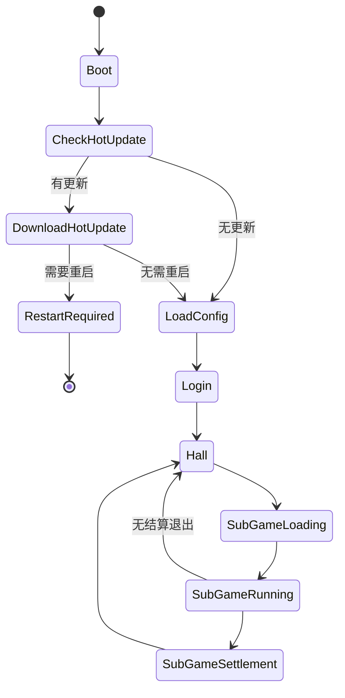
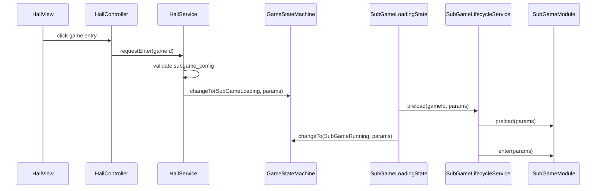
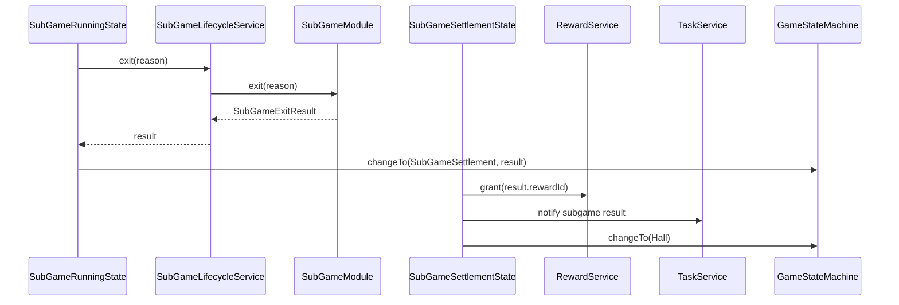

# 大厅与子游戏系统设计

## 1. 系统定位

大厅与子游戏系统用于支持“单 Boot 场景容器 + 大厅 + 多子游戏”的产品形态。`Boot.scene` 只作为运行时容器存在，大厅和子游戏都通过模块、UI prefab、玩法 prefab、配置和资源生命周期动态接入。

本系统不替代 FSM、UIManager、ResourceManager、ModuleRegistry，也不引入超级 Manager。它只定义大厅和子游戏之间的协议、边界、生命周期和资源释放规则。

## 2. 核心原则

- `Boot.scene` 是永久运行容器，不是大厅场景。
- 大厅是业务模块，负责入口展示和进入请求，不直接创建子游戏节点。
- 子游戏是独立业务模块，必须通过统一协议接入。
- 主流程由 FSM 编排，不用 EventBus 串完整进入和退出流程。
- 子游戏资源必须通过 ResourceManager 加载，并在退出时按 owner 释放。
- 子游戏不能直接修改大厅、货币、背包、任务等模块内部 Model。
- 子游戏只能产出明确结果，奖励、货币、背包变更由结算流程调用对应 Service 完成。
- 不允许缺子游戏配置、缺资源、缺 prefab 后 fallback 到默认游戏或 mock 数据。

## 3. 单场景根节点

```text
Boot.scene
├─ AppBootstrap
├─ UIRoot
│  ├─ Background
│  ├─ Normal
│  ├─ Popup
│  ├─ Top
│  └─ System
├─ GameplayRoot
├─ AudioRoot
└─ CameraRoot
```

根节点规则：

- `AppBootstrap` 只绑定并校验根节点，不写大厅和子游戏业务。
- `UIRoot` 只承载 UI 层级，所有 UI 通过 UIManager 打开。
- `GameplayRoot` 只承载当前子游戏玩法节点，子游戏退出时必须清空。
- `AudioRoot` 只承载音频播放组件，音频资源仍由 AudioManager 管理。
- 禁止子游戏通过 `cc.find` 查找根节点，玩法挂载点必须通过明确服务或参数传入。

## 4. 推荐目录结构

```text
assets/scripts/
├─ core/
│  ├─ app/states/
│  │  ├─ HallState.ts
│  │  ├─ SubGameLoadingState.ts
│  │  ├─ SubGameRunningState.ts
│  │  └─ SubGameSettlementState.ts
│  └─ gameplay/
│     ├─ GameplayRootService.ts
│     ├─ SubGameRegistry.ts
│     ├─ SubGameLifecycleService.ts
│     ├─ SubGameResourceScope.ts
│     └─ SubGameTypes.ts
├─ modules/
│  ├─ hall/
│  └─ subgames/
│     ├─ exampleGame/
│     ├─ fishing/
│     └─ slot/
└─ configs/
   └─ SubGameConfig.ts
```

资源目录建议：

```text
assets/resources/
├─ configs/
│  └─ subgame_config.json
├─ prefabs/
│  ├─ ui/
│  └─ subgames/
└─ subgames/
   ├─ exampleGame/
   ├─ fishing/
   └─ slot/
```

如果子游戏较大或需要独立热更新，后续可迁移为 Asset Bundle：

```text
assets/bundles/subgames/exampleGame/
assets/bundles/subgames/fishing/
assets/bundles/subgames/slot/
```

## 5. 主流程 FSM



状态职责：

| 状态 | 职责 | 禁止 |
| --- | --- | --- |
| `HallState` | 打开大厅 UI，等待用户选择子游戏 | 不加载子游戏玩法资源 |
| `SubGameLoadingState` | 校验 `gameId`，加载子游戏配置和资源，显示加载 UI | 不静默跳过缺失资源 |
| `SubGameRunningState` | 创建并运行当前子游戏，接收退出结果 | 不直接发奖励或改存档 |
| `SubGameSettlementState` | 编排结算、奖励、任务进度，返回大厅 | 不直接操作 UI 节点和子游戏内部 Model |

`Home/Battle/Settlement` 可以作为早期单玩法命名保留，但大厅多子游戏模式下建议迁移为 `Hall/SubGameLoading/SubGameRunning/SubGameSettlement`，避免把一个子游戏的概念固化进主流程。

## 6. 子游戏协议

```ts
export interface SubGameModule {
  readonly gameId: string

  preload(params: SubGameEnterParams): Promise<void>
  enter(params: SubGameEnterParams): Promise<void>
  pause(): void
  resume(): void
  exit(reason: SubGameExitReason): Promise<SubGameExitResult>
  dispose(): void
}

export interface SubGameEnterParams {
  readonly gameId: string
  readonly playerId: string
  readonly roomId?: string
  readonly levelId?: string
  readonly seed?: string
}

export interface SubGameExitResult {
  readonly gameId: string
  readonly settlementRequired: boolean
  readonly resultId?: string
  readonly score?: number
  readonly rewardId?: string
}
```

协议规则：

- `gameId` 必须来自配置，不能硬编码散落在 UI 中。
- `preload` 只做资源和配置准备，不创建长期玩法节点。
- `enter` 创建玩法根节点并挂到 `GameplayRoot`。
- `exit` 必须停止计时器、取消事件订阅、销毁玩法节点、释放资源 owner。
- `dispose` 释放模块生命周期内的资源，不允许吞异常。

## 7. 核心类职责

| 类 | 建议路径 | 职责 |
| --- | --- | --- |
| `GameplayRootService` | `assets/scripts/core/gameplay/GameplayRootService.ts` | 持有并校验 `GameplayRoot`，提供挂载和清空能力 |
| `SubGameRegistry` | `assets/scripts/core/gameplay/SubGameRegistry.ts` | 注册和查找子游戏模块 |
| `SubGameLifecycleService` | `assets/scripts/core/gameplay/SubGameLifecycleService.ts` | 编排子游戏 preload、enter、exit、dispose |
| `SubGameResourceScope` | `assets/scripts/core/gameplay/SubGameResourceScope.ts` | 生成资源 ownerId，统一释放子游戏资源 |
| `HallModule` | `assets/scripts/modules/hall/HallModule.ts` | 大厅入口展示和进入请求 |
| `SubGameModule` | `assets/scripts/core/gameplay/SubGameTypes.ts` | 子游戏生命周期协议 |

边界：

- `SubGameRegistry` 只做注册和查询，不做加载、不做结算、不改业务数据。
- `SubGameLifecycleService` 只编排生命周期，不写具体子游戏规则。
- `GameplayRootService` 只管理玩法根节点，不加载资源。
- 子游戏业务仍按 Model / Service / Controller / View 分层。

## 8. 大厅模块

推荐结构：

```text
modules/hall/
├─ HallModule.ts
├─ HallModel.ts
├─ HallService.ts
├─ HallController.ts
├─ HallView.ts
├─ HallTypes.ts
├─ HallEvents.ts
└─ index.ts
```

大厅职责：

- 展示玩家信息、货币、活动和子游戏入口。
- 根据配置展示可进入的子游戏列表。
- 将用户点击转换成 `EnterSubGameRequest`。
- 请求 FSM 进入 `SubGameLoadingState` 或调用明确的流程入口。

大厅禁止：

- 直接加载子游戏 bundle 或 prefab。
- 直接创建子游戏节点。
- 直接修改子游戏内部 Model。
- 通过 EventBus 隐式完成整条进入流程。

## 9. 子游戏配置

建议新增 `subgame_config`：

```ts
export interface SubGameConfig {
  readonly id: string
  readonly displayName: string
  readonly bundle: string
  readonly entryPrefab: string
  readonly loadingUiId: string
  readonly settlementMode: 'common' | 'custom'
  readonly requiredConfigs: readonly string[]
  readonly preloadResources: readonly string[]
}
```

校验规则：

- `id` 不允许重复。
- `displayName`、`bundle`、`entryPrefab`、`loadingUiId` 不能为空。
- `settlementMode` 只能是 `common` 或 `custom`。
- `requiredConfigs` 引用的配置必须存在。
- `preloadResources` 引用的资源必须存在。
- 子游戏模块注册表中必须存在同名 `gameId`。
- 不允许缺字段后自动补默认值。

## 10. 进入子游戏流程



## 11. 退出和结算流程



退出规则：

- 子游戏无论正常结束、主动退出还是异常中断，都必须执行资源清理。
- 如果清理失败必须抛错或上报明确错误，不允许静默留脏节点。
- 结算失败不能直接返回大厅并伪装成功。

## 12. 资源生命周期

资源 ownerId 建议格式：

```text
subgame:<gameId>:<runId>:<resourceVersion>
```

进入子游戏：

- 校验 `subgame_config`。
- 生成本次运行的 `runId`。
- 加载 `requiredConfigs`。
- 预加载 `preloadResources`。
- 创建玩法 prefab 并挂到 `GameplayRoot`。

退出子游戏：

- 关闭子游戏 UI。
- 停止子游戏 timer。
- 取消子游戏事件订阅。
- 销毁 `GameplayRoot` 下当前玩法节点。
- 调用 `ResourceManager.releaseByOwner(ownerId)`。
- 清空子游戏 Model 的临时运行状态。

## 13. EventBus 使用边界

适合使用 EventBus：

- 通知货币变化刷新大厅 UI。
- 通知任务系统记录子游戏完成事件。
- 通知红点系统刷新入口状态。
- 通知统计系统记录进入和退出。

禁止使用 EventBus：

- 用事件链替代 `SubGameLifecycleService.enter`。
- 用事件链隐式创建玩法节点。
- 用事件链跨模块修改其他模块 Model。
- 用事件吞掉进入、加载、结算失败。

## 14. Fail-Fast 规则

- `GameplayRoot` 未绑定直接报错。
- `gameId` 不存在直接报错。
- 子游戏模块未注册直接报错。
- 子游戏配置缺字段直接报错。
- 子游戏 prefab 缺失直接报错。
- 子游戏资源加载失败直接报错。
- 子游戏非法状态切换直接报错。
- 子游戏退出后仍有未释放 owner 资源必须暴露错误。
- 结算奖励配置缺失直接报错。

## 15. 开发任务

1. 在 `Boot.scene` 增加 `GameplayRoot` 并由 `AppBootstrap` 显式绑定。
2. 新增 `GameplayRootService` 并注册到 `AppContext`。
3. 定义 `SubGameModule`、`SubGameEnterParams`、`SubGameExitResult`。
4. 实现 `SubGameRegistry`，只负责注册和查找。
5. 实现 `SubGameLifecycleService`，统一编排 preload、enter、exit、dispose。
6. 新增 `HallState`、`SubGameLoadingState`、`SubGameRunningState`、`SubGameSettlementState`。
7. 更新 `GameStateMachine` 转移表。
8. 新增 `subgame_config` 类型、validator 和 repository。
9. 新增 `HallModule` 与 `HallUI`。
10. 接入一个最小 `exampleGame` 子游戏，验证从大厅进入、运行、退出、结算、返回大厅。
11. 增加资源释放验收，确保退出子游戏后 `GameplayRoot` 为空且 owner 资源释放。

## 16. 验收标准

- 项目启动后进入大厅，而不是直接进入某个固定玩法。
- 大厅能通过配置展示子游戏入口。
- 至少一个示例子游戏能完整跑通进入、退出、结算、返回大厅。
- 子游戏退出后不会残留节点、timer、事件订阅和资源 owner。
- 子游戏失败会暴露明确错误，不会 fallback 到默认子游戏。
- 大厅和子游戏之间没有内部 Model 穿透。
